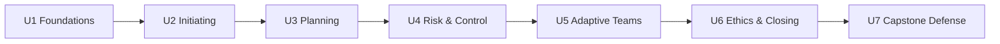

# Project Management — PM-401

**7th semester · BS Computer Science & BS Data Science · 16 weeks · 32 lectures · 64 contact hours**
**Instructor:** Dr. Muhammad Nadeem Majeed

A complete, standards-anchored course in modern project management for
software and data projects: PMBOK 7 principles, ISO 31000 risk practice,
Scrum and Kanban delivery, earned-value control, and a semester-long
capstone defended in week 16.

## Quick facts

| | |
|---|---|
| Lectures | 32 × 2 h (see [curriculum map](lectures/index.md)) |
| Case studies | 105 progressive cases; all published, 100 anchored in class ([directory](cases/index.md)) |
| Assessment | 8 components, 100% (see [grading](assessments/grading.md)) |
| Capstone | Team project plan + defense ([charter](capstone/capstone-charter.md)) |
| Standards | PMBOK 7 · PMBOK 6 vocabulary · ISO 21502 · ISO 31000 · Scrum Guide 2020 |

## Start here

1. Read the [course description](syllabus/course-description.md) — objectives,
   measurable CLOs, and eligibility — then the
   [detailed syllabus](syllabus/detailed-syllabus.md) for the knowledge-area
   map and the [weekly schedule](syllabus/weekly-schedule.md).
2. Skim the [curriculum map](lectures/index.md) — notice the arc from
   *why projects fail* (L01) to *capstone defense* (L32).
3. Bookmark the [case directory](cases/index.md); your portfolio (10% of the
   grade) is built from these.
4. Read the ground rules once, carefully:
   [assessment strategy](assessments/assessment-strategy.md) ·
   [grading](assessments/grading.md) ·
   [integrity & responsible AI](assessments/academic-integrity.md) ·
   [course policies](syllabus/course-policies.md) ·
   [textbooks](syllabus/textbooks.md).

## Course arc

## Handy pages

- [Semester calendar](calendar/index.md) — every lecture, lab, and assessment in one grid
  ([printable](calendar/printable.md), [CSV](calendar/schedule.csv))
- [Learning outcomes (CLOs)](syllabus/clos.md) — what you'll be able to do, mapped to assessments
- [Downloads](downloads.md) — every template and worksheet file in one list
- [FAQ](faq.md) — workload, missed quizzes, AI rules, where the answer keys live
- [About the course](about.md) — design principles, standards used, how this site is built
