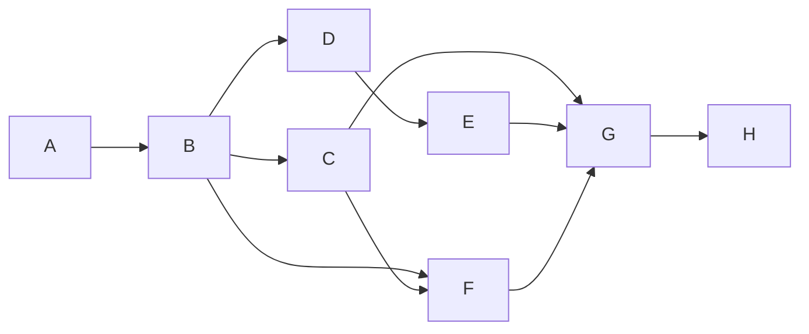

<!--
Template: Activity list & dependency network (Lab 4)
Dependency types: FS finish-to-start (default) · SS start-to-start ·
FF finish-to-finish · SF start-to-finish (rare). Leads (-) pull work earlier;
lags (+) push it later. Every predecessor must name its type when not FS.
-->

# Activity List & Dependency Network — [Project name]

## 1. Activity table
| ID | Activity | Predecessor(s) (ID + type ± lead/lag) | Duration | Owner |
|---|---|---|---|---|
| A | | — | | |
| B | | A (FS) | | |

## 2. Network diagram (AON)
Draw the node network (paper photo, draw.io, or Mermaid). Convention:
nodes = activities, arrows = dependencies; annotate lags on arrows.

*(example topology from CAMPUS-MEND — replace with yours)*

## 3. Dependency sanity checks (do before scheduling)
| Check | Result |
|---|---|
| No cycles (network is a DAG) | ☐ |
| Every activity has a path from start to finish | ☐ |
| No "preferential" dependency pretending to be mandatory (label discretionary ones) | ☐ |
| External dependencies (vendor, calendar) shown as explicit constraints | ☐ |
| Leads/lags justified (what physical rule makes F start before C finishes?) | ☐ |

## 4. Forward/backward pass worksheet
Transfer to the [CPM worksheet](cpm-worksheet-template.md) — ES/EF left to
right, LS/LF right to left, float = LS − ES.
