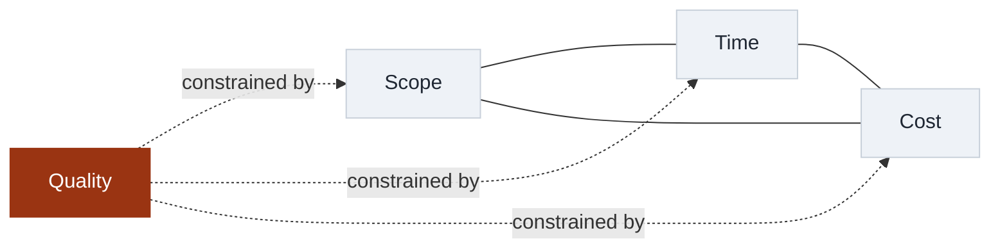

# PM-401 · Project Management

## L01 · Why Projects Fail: The Case for Project Management

Dr. Muhammad Nadeem Majeed · BS CS & BS Data Science · Semester 7

16 weeks · 32 lectures · 64 contact hours

<!-- _class: lead -->

---

## Learning objectives

By the end of this session you can:

1. **Distinguish** a project from operations — and say which is which in your own world
2. **Explain** the iron triangle and why it is a model, not a law
3. **Interpret** why two teams with the same budget reach different outcomes
4. **Locate** where this course is going: CLOs, capstone, and the 16-week arc

<!-- notes: Open with the failure-story hook from the teaching package (CS-01's iron-triangle autopsy). Ask: "who has been on something that slipped?" — normalize failure before defining it. State that CLO1 is assessed first in Quiz 1 (L04). Timing: ~5 min. -->

---

## What is a project?

- **Temporary** — it has a start and an end
- **Unique** — it produces something that did not exist before
- **Progressive elaboration** — details emerge; you don't know everything on day 1

Everything else — payroll, support desks, model retraining — is **operations**.

<https://github.com/nadeem-majeedch/Project-Management> · `docs/lectures/L01`

<!-- notes: Anchor with the teaching-package definitions. Quick poll: "predictive or agile — which fits a final-year FYP better?" Flag progressive elaboration as the bridge to L08 tailoring. -->

---

## The iron triangle

- Fix any two, the third **moves**
- Quality sits **inside** the triangle — or gets silently squeezed

<!-- notes: CS-01 autopsy: the project that fixed scope, time, and cost — so quality took the hit. Ask students to name a real case where quality was the invisible fourth variable. 2 min. -->

---

## Same budget, different outcomes

- **CS-02:** two teams, equal funding — one ships, one stalls
  - Difference was **not** money: it was scope control, stakeholder contact, early risk naming
- Success ≠ on-time only: it is **value delivered + stakeholders satisfied**
- Failure is usually a **process** failure, not a coding failure

<!-- notes: Emphasize process over heroics — this is the course thesis. Students will meet CS-02's twins again in the capstone kickoff (L30). 2 min. -->

---

## CS / DS in the room

- **CS:** a three-person mobile-app FYP that misses its demo deadline — classic triangle squeeze
- **DS:** a churn-model project whose *data readiness* was never scheduled — failure without a single line of bad code
- Same triangle, different failure surface

<!-- notes: DS example is the important one for this cohort: data projects fail on preparation, not modelling. Sets up L09 (scope/WBS) and L15 (risk). -->

---

## Case anchor:

**CS-01** — *Iron-triangle autopsy*: reconstruct which corner was fixed, which moved, and what paid the price

**CS-02** — *Success/failure twins*: same budget, opposite outcomes; identify the three process differences

Case slides and full briefs: [`docs/cases/`](../../docs/cases/index.md)

<!-- notes: Both are Beginner-band; CS-01 is the in-class worked discussion today, CS-02 is homework reading. Keys are instructor-only (instructor/answer-keys/cases/). -->

---

## Discussion

1. Is your FYP a project or an operation — and does the answer change how you plan it?
2. Which triangle corner is *usually* fixed in university projects? Who fixed it?
3. Can a project be "on time, on budget" and still fail?

<!-- notes: Q3 is the load-bearing question — it separates output metrics from outcome metrics, the L20 monitoring signal distinction. Take 2–3 answers, don't resolve yet. -->

---

## Summary & exit ticket

- Project = temporary + unique; operations = repeatable
- The iron triangle is a **constraint model**, not a law
- Process quality, not funding, separates the twins

**Exit ticket (2 min, anonymous):** write **one** project you are inside of, and label each triangle corner *fixed / flexible / ignored*.

Bring it next lecture — we will use it in L02's portfolio exercise.

<!-- notes: Exit tickets are formative only — not graded, but the aggregate pattern informs Lecture 2's opening. -->

---

## References & next lecture

- PMBOK® Guide 7th ed. — *The Standard for Project Management* (principles & performance domains)
- ISO 21502:2020 — *Project, programme and portfolio management*
- Teaching package: `instructor/teaching-packages/U1-foundations-strategy/L01-01-why-projects-fail.md`
- **Next:** L02 — Strategy, Portfolios, Programs & Projects (bring your exit ticket)

<!-- notes: All references cite standards actually in the syllabus. Preview: the exit ticket feeds the portfolio cut-line exercise in CS-03. -->
