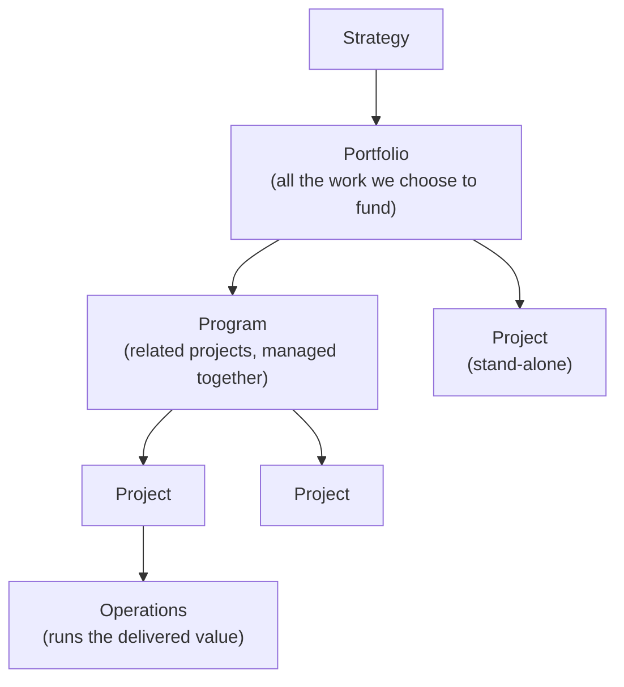

# L02 · Strategy, Portfolios, Programs & Projects

## Four words people use interchangeably — and shouldn't

Week 1 · Unit U1 · CLO1 · 2 hours

<!-- _class: lead -->

---

## Learning objectives

1. **Define** portfolio, program, project, and operations — and place real work correctly
2. **Apply** a weighted scoring model to rank candidate projects
3. **Select** a project bundle under a fixed budget and defend it
4. **Explain** why strategy alignment outranks raw score

<!-- notes: Anchor with the teaching-package definitions. Quick poll: "predictive or agile — which fits a final-year FYP better?" Flag progressive elaboration as the bridge to L08 tailoring. Timing: ~5 min. -->

---

## Four containers, one strategy

- **Portfolio:** *choosing* the work — aligned to strategy
- **Program:** *coordinating* related projects for a combined benefit
- **Project:** *delivering* a unique output
- **Operations:** *running* what was delivered

<!-- notes: Emphasize the different questions each level answers: portfolio = "which?", program = "how do these fit together?", project = "how do we deliver?". 3 min. -->

---

## Weighted scoring: ranking candidates

| Criterion | Weight | P1 Telehealth | P2 Chatbot | P3 Dashboard |
|---|---|---|---|---|
| Strategy alignment | 0.5 | 4 × 0.5 = 2.0 | 3 × 0.5 = 1.5 | 2 × 0.5 = 1.0 |
| Payback speed | 0.3 | 3 × 0.3 = 0.9 | 4 × 0.3 = 1.2 | 2 × 0.3 = 0.6 |
| Risk exposure | 0.2 | 2 × 0.2 = 0.4 | 3 × 0.2 = 0.6 | 3 × 0.2 = 0.6 |
| **Weighted score** | | **3.3** | **3.3** | **2.2** |

Scores 1–5 · weights sum to 1.0 · CS-03's full model has six criteria

<!-- notes: Point out that P1 and P3 tie at 3.3 — a tie is not a bug; it forces a strategy conversation. In CS-03 the tie-break question is marginal value per million rupees. 4 min, board-ready. -->

---

## CS / DS in the room

- **CS:** a software house juggling a portal rebuild (project), a mobile-app suite (program), and support desk (operations)
- **DS:** a retail analytics portfolio — forecasting models, dashboards, MLOps platform build; the ML projects compete for the **same** data-engineer pool
- Portfolio management is where the DS talent bottleneck actually gets solved

<!-- notes: The DS example lands the resource-sharing point: two separately 'good' ML projects can be jointly infeasible. Sets up CS-95 rebalancing. 2 min. -->

---

## Case anchor:

**CS-03** — *Portfolio cut-line*: weighted scores are given; the budget forces a cut — and the top-scored project is **not** in the optimal bundle (verified arithmetic; the trap is the lesson)

**CS-95** — *Rebalancing*: reweight a live portfolio when strategy shifts mid-year

<!-- notes: CS-03 is the in-class worked discussion; the checker verifies the optimal bundle excludes the highest raw score. Say that out loud — it primes the evaluation-criteria discussion. -->

---

## Discussion

1. Your university has budget for **two** of: LMS upgrade, research-data platform, campus app. Which weights would *you* choose — and would the winners change if strategy shifted to "research excellence"?
2. When does a group of projects deserve program-level coordination rather than independent management?
3. Who should own portfolio decisions: sponsor, PMO, or delivery teams?

<!-- notes: Q1 mirrors CS-03's structure so students practice before the case. Q3 seeds the L28 governance lecture. Take one answer per question; 6–8 min total. -->

---

## Summary & exit ticket

- Portfolio **selects**, program **coordinates**, project **delivers**, operations **runs**
- Weighted scoring makes trade-offs explicit — ties included
- Score is an input to strategy conversation, not a verdict

**Exit ticket (2 min):** from L01's ticket, name **one** project that should be managed at program level with a sibling project — and say why.

<!-- notes: Collect and skim before L03; common wrong answer is any big project. Program requires relatedness and combined benefit, not size. -->

---

## References & next lecture

- PMBOK® Guide 7th ed. — portfolio & program management context
- ISO 21502:2020 — governance of projects, programs, portfolios
- Teaching package: `instructor/teaching-packages/U1-foundations-strategy/L02-02-strategy-portfolio.md`
- **Next:** L03 — PMBOK 7 principles & performance domains (the course's structural spine)

<!-- notes: Standards citations match the syllabus reference list. Preview: L03 introduces the 12 principles; Quiz 1 at L04 covers L01–L04. -->
