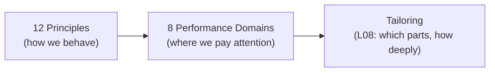
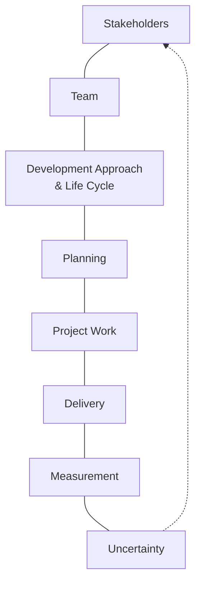

# L03 · PMBOK Guide 7: Principles & Performance Domains

## The course's structural spine

Week 1 · Unit U1 · CLO1 · 2 hours

<!-- _class: lead -->

---

## Learning objectives

1. **Name** the 12 PM principles and pair each with a CS/DS work situation
2. **Describe** the 8 performance domains and what each produces
3. **Explain** why PMBOK 7 replaced process prescriptions with principles
4. **Apply** the domains as a checklist on any project you join

<!-- notes: Anchor with the teaching package; the 12 principles are listed on its definitions section — have it open. This is the most 'map-heavy' lecture of U1; keep each principle to one sentence + one example. Timing: ~5 min. -->

---

## Why principles, not processes?

- PMBOK 6: **49 processes**, fixed inputs/outputs — worked for predictive builds
- PMBOK 7: **12 principles** + **8 performance domains** — works for *any* delivery approach
- Principle = a rule of **conduct**; domain = an area of **focus**, not a phase

<!-- notes: This slide answers the inevitable 'why did the numbering change?' question. Tailoring preview primes L08. 3 min. -->

---

## The 12 principles — the conduct layer

- Stewardship · Team · Stakeholders · **Value** · Systems thinking · **Leadership**
- Tailoring · **Quality** · **Complexity** · **Risk** · Adaptability & resilience · **Change**

Pair each with CS/DS reality:

- *Value* → a model that is 2% more accurate but ships late helps **nobody**
- *Complexity* → a distributed pipeline is a system, not a task list
- *Adaptability* → your sprint plan survives contact with a hostile API

<!-- notes: Bolded ones are the CLO1 exam anchors per QB-U1. The three CS/DS pairings come from the teaching package's examples section — keep them verbatim for consistency. 6 min with student pairings. -->

---

## The 8 performance domains — the focus layer

- Domains run **concurrently**, not in sequence
- Each maps to specific lectures: Planning → L09–L14 · Uncertainty → L15–L20 · Measurement → L19–L20

<!-- notes: The cycle diagram is the slide to photograph — it recurs in the L30 capstone kickoff. Say the domain-to-lecture mapping out loud so students see the syllabus inside the framework. 5 min. -->

---

## CS / DS in the room

- **CS:** a microservice rebuild — domains fire simultaneously: stakeholders (audit team) need answers while planning (schema) is still fluid
- **DS:** a fraud-model project — *Uncertainty* domain dominates (data quality unknowns) before *Delivery* takes over
- Same 8 domains, different center of gravity — that is **tailoring** (L08)

<!-- notes: Center-of-gravity language comes straight from the teaching package. Ask students to predict which domain will dominate THEIR capstone — revisit at L30. 3 min. -->

---

## Case anchor:

**CS-04** — *Sorting 20 artifacts into PMBOK 7 domains*: team-sorting exercise; argues the boundary cases, then defends against the model answer

<!-- notes: Single-anchor lecture (Beginner band). Run as a 10-minute pair-sort, then defend the two hardest placements. Quiz 1 (next lecture) covers this material at MCQ depth instead. -->

---

## Discussion

1. Which principle would have prevented your worst group-project experience?
2. Can a team 'do everything right' in every domain and still fail? What does that tell you about checklists?
3. Why did PMI move from 49 processes to 12 principles — what changed in the industry?

<!-- notes: Q3 is the discussion anchor; expected direction: agile's rise made prescriptive processes brittle. 6 min. -->

---

## Summary & exit ticket

- **12 principles** = how professionals behave; **8 domains** = where attention goes
- Domains overlap and fire concurrently — sequence is a *choice*, not a default
- Tailoring (L08) decides how deeply each domain gets worked

**Exit ticket (2 min):** write the **one domain** you predict will dominate your capstone project — we will compare with L30.

<!-- notes: Collect tickets; they will be read back in L30 as a prediction exercise. Formatative only. -->

---

## References & next lecture

- PMI (2021) *The Standard for Project Management and A Guide to the Project Management Body of Knowledge (PMBOK® Guide)* — 7th ed., sections 1–3
- Teaching package: `instructor/teaching-packages/U1-foundations-strategy/L03-03-pmbok7-principles-domains.md`
- **Next:** L04 — Roles & the PM profession · **Quiz 1 (L01–L04) opens at the start of class**

<!-- notes: Reminder: Quiz 1 is 15 minutes at the start of L04, best-2-of-3 counting per the syllabus. QB-U1 items are drawn from these three lectures. -->
