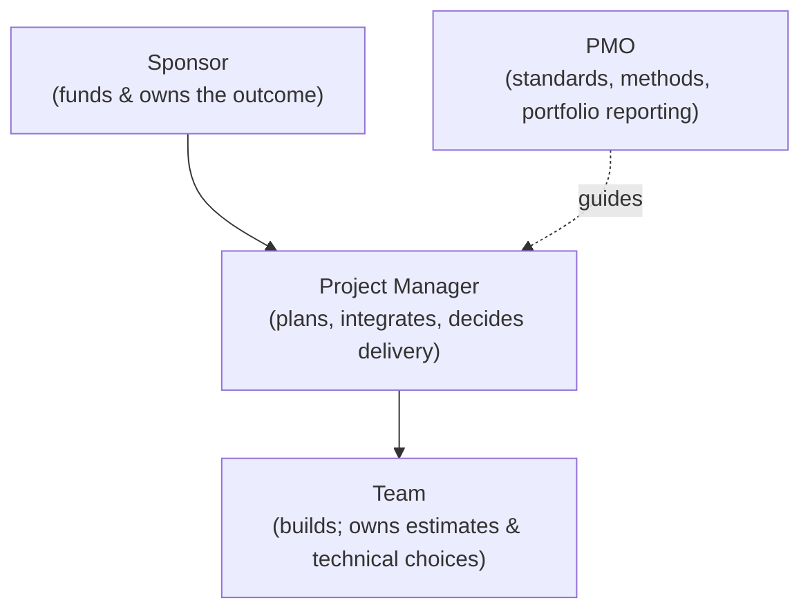

# L04 · Roles, Competencies & the PM Profession

## Who actually does what — and who is accountable

Week 2 · Unit U1 · CLO1 · 2 hours

<!-- _class: lead -->

---

## Learning objectives

1. **Distinguish** sponsor, PM, team, and PMO by decision rights, not job titles
2. **Build** a RACI chart for a real team and spot its failure modes
3. **Explain** the PM's dual accountability: to the sponsor *and* to the team
4. **Evaluate** an ethical conflict using a professional code as the standard

<!-- notes: RACI is the operational heart; the accountability discussion is the assessment-relevant part (CLO1, Quiz 1 today covers L01–L04). Run Quiz 1 (15 min) BEFORE this deck — see instructor/exam-bank/quiz1.md. -->

---

## Who holds which decisions

- **Sponsor** says *whether*; **PM** says *how*; **team** says *how long*
- PMO advises and audits — it does **not** run your project
- In Agile teams, the ScrumMaster is a facilitator, **not** a PM replacement (L23)

<!-- notes: The 'says-what' triplet is from the teaching package; it resolves most RACI disputes. Flag the sponsor/PM boundary as the recurring exam trap: sponsors approve baselines, PMs propose them. 4 min. -->

---

## RACI: responsibility without ambiguity

| Activity | Sponsor | PM | Lead Dev | QA |
|---|---|---|---|---|
| Approve charter | **A** | R | C | I |
| Estimate effort | I | A | **R** | C |
| Sign off release | **A** | R | C | C |
| Triage defects | I | A | C | **R** |

- **R** does the work · **A** owns the outcome (**one per row**) · **C** consulted · **I** informed
- Failure modes: two A's (standoff) · zero A's (orphan task) · all C's (nobody builds)

<!-- notes: CS-05 is exactly this exercise on a campus portal team. The QA row is deliberately controversial: who A's defect triage? Let them argue. 5 min. -->

---

## CS / DS in the room

- **CS:** a startup where the founder sponsors three projects and also 'helps' with code — RACI exposes why reviews stall
- **DS:** an ML project where the *data owner* is neither R nor A for feature work — the silent stall pattern in analytics teams
- Decision rights ≠ org-chart seniority

<!-- notes: The DS pattern is the teaching package's key example: analytics projects fail quietly when data ownership is unassigned. 2 min. -->

---

## Case anchor:

**CS-05** — *RACI for a campus portal team*: build the chart, find the double-A row, fix the orphan task

<!-- notes: Pair exercise (10 min), defend on the board. Keys: instructor/answer-keys/cases/CS-05.md. Bridge: a RACI is only as good as the charter behind it — next lecture starts that chain. -->

---

## Discussion

1. Can a sponsor also be a customer — and what breaks when they are?
2. Your PM asks you (a student on a team) to hide a slip from the sponsor. Which code or principle applies — and what do you actually do?
3. What does a PM *owe* the team, not just the sponsor?

<!-- notes: Q2 is the ethics seed for L29 and CLO6 — cite the PMI Code of Ethics (responsibility, respect, fairness, honesty). Do not resolve it; assign reflection. 6 min. -->

---

## Summary & exit ticket

- Decision rights, not titles, define the roles
- RACI's three failure modes: two A's, zero A's, all C's
- PM accountability runs **both ways** — and ethics codes bind it

**Exit ticket (2 min):** draw the RACI row for *your capstone's* "approve scope change" — name who is A, and say why only one A may exist.

<!-- notes: Feeds the L08 tailoring lecture (who approves changes on a small project?). Quiz 1 results inform pacing for U2. -->

---

## References & next lecture

- PMI (2021) *PMBOK® Guide* 7th ed., team performance domain
- PMI *Code of Ethics and Professional Conduct* (responsibility · respect · fairness · honesty)
- Teaching package: `instructor/teaching-packages/U1-foundations-strategy/L04-04-roles-profession.md`
- **Next:** L05 — Life Cycles: predictive, agile, and the hybrids between (Unit U2 opens)

<!-- notes: Preview U2 with the life-cycle choice as a spectrum, not a switch. Quiz 1 marking guide: instructor/exam-bank/quiz1.md. -->
