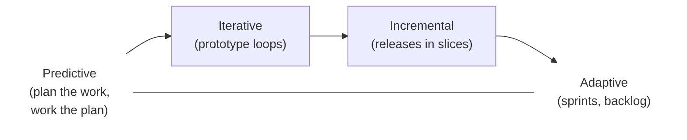
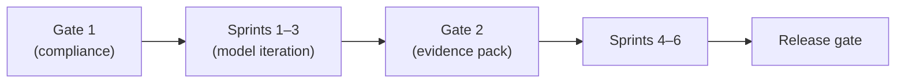

# L05 · Life Cycles: Predictive, Adaptive, Hybrid

## Choosing how you will deliver before deciding what you deliver

Week 3 · Unit U2 · CLO2 · 2 hours

<!-- _class: lead -->

---

## Learning objectives

1. **Compare** predictive, iterative, incremental, and adaptive life cycles on change and certainty
2. **Match** a project's uncertainty profile to a life cycle — and defend the match
3. **Design** a hybrid life cycle with an explicit handover point
4. **Justify** why life-cycle choice is a governance decision, not a fashion

<!-- notes: The spectrum is the core visual; CS-06's five vignettes exercise it. Keep definitions tight — the misconceptions live in the teaching package (e.g., 'agile = no planning'). Timing ~5 min. -->

---

## The delivery spectrum

- Left: requirements **known**, change is expensive → **predictive**
- Right: requirements **emerging**, change is expected → **adaptive**
- Most real projects live **between** — iterative or incremental

<!-- notes: Anchor with the teaching package's change/certainty table. Ask for one example of each extreme from student experience. 4 min. -->

---

## Life cycle × change × certainty

| Life cycle | Requirements | Change | Feedback cadence |
|---|---|---|---|
| Predictive | fixed early | costly, controlled | milestones |
| Iterative | refined via prototypes | moderate | prototype loops |
| Incremental | stable per release | staged | each release |
| Adaptive | discovered per sprint | expected | every sprint |

- Same triangle (L01) applies on **every** cell — only the feedback rate differs

<!-- notes: Emphasize the last bullet: life cycle changes HOW you steer, not WHETHER the triangle binds. Sets up CS-07's regulated hybrid. 3 min. -->

---

## Hybrid: the regulated data product

**CS-07 pattern** — a regulated data product needs both:

- **Predictive spine:** compliance gates, audit evidence, sign-offs — fixed dates
- **Adaptive flesh:** model iteration between gates

- The handover point is a **contract**: what evidence moves forward?

<!-- notes: This is the CS-07 solution shape. Stress the handover contract — students often design hybrids without saying what crosses the gate. 4 min. -->

---

## CS / DS in the room

- **CS:** a payments integration — vendor API fixed, UX still fluid → predictive for the API layer, incremental releases for UX
- **DS:** an NLP classifier for a regulator — gates for evidence, sprints for tuning
- Choosing 'agile because it's modern' is a governance failure, not a style

<!-- notes: The last line is the assessment sentence — it appears in QB-U2 and the final exam's judgment section. 2 min. -->

---

## Case anchor:

**CS-06** — *Life-cycle choice for five vignettes*: five mini-projects, five decisions, one defense each
**CS-07** — *Hybrid decision for a regulated data product*: design the gates and the handover contract

<!-- notes: CS-06 in pairs (15 min), CS-07 as a plenary design. Keys in instructor/answer-keys/cases/. Bridge to L06: whatever the cycle, every project still needs a charter. -->

---

## Discussion

1. Your FYP advisor insists on waterfall; your team wants Scrum. What evidence would settle the argument?
2. When is a **pure** life cycle actually the right answer?
3. What breaks in a hybrid when the gate evidence is written *after* the gate?

<!-- notes: Q3 previews L26 change control — gates with retrospective evidence are theatre, not governance. 6 min. -->

---

## Summary & exit ticket

- Life cycle = **feedback cadence** chosen from change/certainty, not preference
- Hybrids need an explicit **handover contract** at every gate
- The triangle binds on every cell of the spectrum

**Exit ticket (2 min):** place your capstone on the spectrum, mark its **center of gravity**, and write the one gate it must have.

<!-- notes: Tickets feed the L08 tailoring lecture — small projects still tailor, and this gives each student a concrete object to tailor. -->

---

## References & next lecture

- PMI (2021) *PMBOK® Guide* 7th ed. — development approach & life-cycle domain
- Agile Manifesto (2001) — *Principles behind the Agile Manifesto*
- Teaching package: `instructor/teaching-packages/U2-lifecycles-initiating/L05-05-lifecycles.md`
- **Next:** L06 — Project Charters: one page that starts the work

<!-- notes: Standards match the syllabus reference list. Preview L06 with the charter-under-pressure framing. -->
