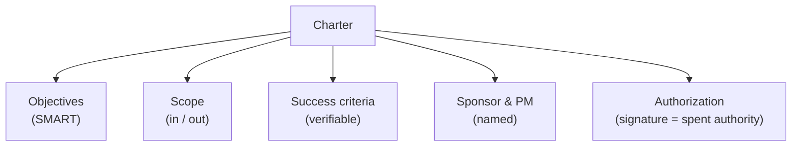

# L06 · Project Charter & Business Case

## One page that starts the work

Week 3 · Unit U2 · CLO2 · 2 hours

<!-- _class: lead -->

---

## Learning objectives

1. **Compose** a one-page charter that a sponsor could actually sign
2. **Separate** scope (in/out) from success criteria (verifiable)
3. **Explain** what authorization legally and practically means
4. **Reject** vague objectives using the SMART test

<!-- notes: Lab 1 this week uses exactly this anatomy on the CAMPUS-MEND brief — say so up front. Keep the anatomy slide canonical; students will reuse it in their capstone M1. Timing ~5 min. -->

---

## What a charter must settle

- One page. If it needs two, the **second page is a scope statement** — move it (L09)

<!-- notes: The one-page discipline is the teaching package's core rule. Preview: scope statement is the charter's deeper sibling, next lecture. 3 min. -->

---

## SMART objectives vs success criteria

| Charter field | Bad | Good |
|---|---|---|
| Objective | "Improve the portal" | "Cut average result-lookup time from 40 s to under 5 s by semester start" |
| Success criterion | "Users like it" | "≥ 70% of sampled users complete lookup unaided in usability test" |

- Objectives = **what we intend** · Success criteria = **how we will know**
- If you cannot name the measurement, it is not a criterion

<!-- notes: The 40s→5s example is from the teaching package's worked example. Make students convert one of their own FYP goals live. 5 min. -->

---

## Authorization is not a rubber stamp

- Signature = the sponsor **spends authority**: budget released, team may commit
- Undersigned charters produce the classic failure: work proceeds, decisions stall
- **CS-08's trap:** under deadline pressure, the team *started* before authorization — recover, don't just finish

<!-- notes: CS-08 is the pressure case; its key discusses recovery via retroactive ratification vs restart. Connect to L04: authorization is the sponsor's A in the RACI. 3 min. -->

---

## CS / DS in the room

- **CS:** a hackathon-winning prototype that skipped its charter — six months later, nobody can say who owns it
- **DS:** a "quick analysis" request that became a four-month model build — the charter that was never written is the scope that was never agreed
- Lab 1: you will write CAMPUS-MEND's charter from a messy sponsor email

<!-- notes: The DS 'quick analysis' pattern is the cohort's most common future failure — name it directly. Point to Lab 1 (docs/labs/lab-01-charter.md) and the template in docs/templates/. 3 min. -->

---

## Case anchor:

**CS-08** — *One-page charter under pressure*: sponsor announces a demo in 72 hours; write the charter anyway, then defend what you cut

<!-- notes: 15-minute in-class write against Lab 1's template, then defend. Key: instructor/answer-keys/cases/CS-08.md. The teaching package's preparation notes have the pressure details. -->

---

## Discussion

1. Who should *write* the charter — sponsor or PM? Who *signs* it, and why must those differ?
2. Can success criteria change mid-project? What does that imply about the charter?
3. What is the minimum viable charter for a two-week spike?

<!-- notes: Q3 connects to L21's spike concept — even exploratory work needs an exit criterion. 6 min. -->

---

## Summary & exit ticket

- Charter = objectives + scope + success criteria + named authority + signature
- SMART objectives **intend**; success criteria **prove**
- Authorization releases real authority — treat it as spending, not ceremony

**Exit ticket (2 min):** write one SMART objective for your capstone, and the success criterion that would *falsify* it.

<!-- notes: The falsification framing is deliberate — it pre-loads the quality-metrics mindset for L17. Skim tickets before L07. -->

---

## References & next lecture

- PMI (2021) *PMBOK® Guide* 7th ed. — initiating processes & project charter
- Template: [`docs/templates/charter-template.md`](../../docs/templates/index.md)
- Lab 1 brief: [`docs/labs/lab-01-charter.md`](../../docs/labs/index.md)
- Teaching package: `instructor/teaching-packages/U2-lifecycles-initiating/L06-06-charter.md`
- **Next:** L07 — Stakeholders: who can stop your project, and what they want

<!-- notes: Preview L07 with the CS-09 stakeholder hunt. Lab 1 is due in a week per the syllabus schedule. -->
