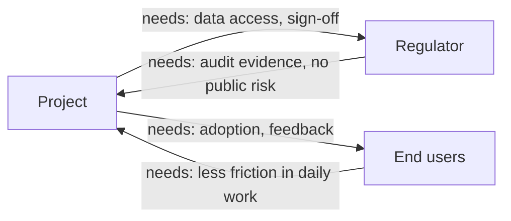
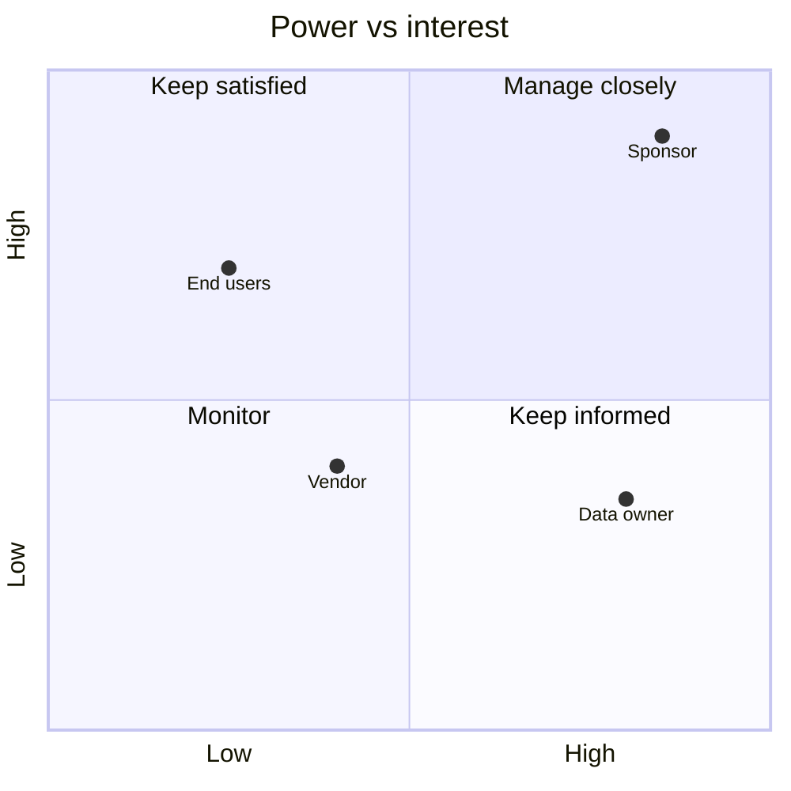

# L07 · Stakeholder Identification & Analysis

## Who can stop your project — and what they want

Week 4 · Unit U2 · CLO2 · 2 hours

<!-- _class: lead -->

---

## Learning objectives

1. **Identify** stakeholders through exchanges (what each side needs), not name lists
2. **Assess** power and interest with evidence, not intuition
3. **Design** engagement strategies per grid quadrant — and move stakeholders when needed
4. **Detect** the silent stakeholders who surface late and cost most

<!-- notes: The exchanges framing is the teaching package's core idea and the grid is its visual heart. Labs 2 uses both — point at the brief early. Timing ~5 min. -->

---

## Exchanges, not name lists

- A stakeholder entry without an exchange is **incomplete**
- The exchange tells you *what to offer*, the grid tells you *where to aim it*

<!-- notes: Do one live exchange for a student-named stakeholder (registrar, data owner, DPO...). The two-way arrows matter: your side of the exchange is your leverage. 4 min. -->

---

## The power–interest grid

- **Keep satisfied** (high power, low interest) is where projects die quietly
- Strategy per quadrant: manage closely · keep satisfied · keep informed · monitor

<!-- notes: The data-owner placement is the DS cohort's signature pattern (Lab 2 builds this). Ask where a DPO sits on a student's project — usually high power, low interest until something goes wrong. 5 min. -->

---

## Moving stakeholders

- The grid is a **snapshot**; engagement is **movement**
- *Keep satisfied* → *manage closely*: brief early, before they ask
- *Monitor* → *keep informed*: a silent skeptic becomes an active blocker at review time
- Every movement plan costs hours — budget them in the communication plan (L18)

<!-- notes: CS-10 is the engagement-gap exercise. The movement-cost point sets up L18's comms planning arithmetic. 3 min. -->

---

## CS / DS in the room

- **CS:** a campus portal rollout — the registrar can stop it with one signature; students (users) can starve it of adoption
- **DS:** a hospital analytics project — the *data owner* holds access, the *clinicians* hold truth, the DPO holds consent rules (CS-09's hunt)
- Silent stakeholders in DS projects: the people whose data you are modelling

<!-- notes: The last line lands the responsible-data point that returns in L27's governance lecture. CS-09/CS-10 are the paired in-class exercises. 3 min. -->

---

## Case anchor:

**CS-09** — *Stakeholder hunt on a hospital analytics project*: find the eight stakeholders hiding in the scenario
**CS-10** — *Power–interest grid and engagement plan*: place them, then close the engagement gaps

<!-- notes: Run CS-09 as a hunt (10 min), CS-10 as grid-building on CS-09's results (10 min). Keys: instructor/answer-keys/cases/CS-09.md, CS-10.md. Lab 2 extends this to the CAMPUS-MEND register. -->

---

## Discussion

1. Who is a stakeholder of *your* FYP that nobody has contacted yet?
2. Can a stakeholder be fully satisfied and still block you? What does that reveal about the grid's limits?
3. When is it ethical to *avoid* engaging a stakeholder?

<!-- notes: Q3 is the governance seed — opponents with legitimate claims still deserve hearing, not silence; full treatment in L29. 6 min. -->

---

## Summary & exit ticket

- Stakeholders are defined by **exchanges**, discovered by **hunting**, aimed at via the **grid**
- The dangerous quadrant is *keep satisfied* — high power, ignored interest
- Engagement is movement over time, budgeted like any other work

**Exit ticket (2 min):** write one exchange (both directions) between your capstone and its most dangerous stakeholder.

<!-- notes: Tickets preview the M1 capstone stakeholder register. Formative only. -->

---

## References & next lecture

- PMI (2021) *PMBOK® Guide* 7th ed. — stakeholder performance domain
- Template: [`docs/templates/stakeholder-register-template.md`](../../docs/templates/index.md) · Lab 2 brief: [`docs/labs/lab-02-stakeholders.md`](../../docs/labs/index.md)
- Teaching package: `instructor/teaching-packages/U2-lifecycles-initiating/L07-07-stakeholders.md`
- **Next:** L08 — Tailoring: shrinking the framework to fit the project

<!-- notes: Preview L08 with the six-week-project tailoring exercise (CS-11). -->
