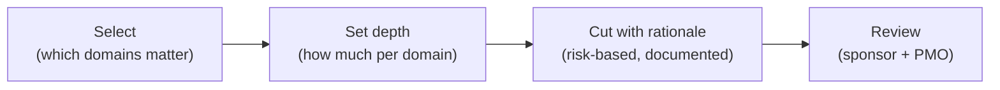

# L08 · Tailoring for Software & Data Projects

## Shrinking the framework to fit the project — not the other way round

Week 4 · Unit U2 · CLO2 · 2 hours

<!-- _class: lead -->

---

## Learning objectives

1. **Distinguish** tailoring from skipping: what is *simplified*, what is *kept*
2. **Apply** a tailoring pass to a heavyweight template for a six-week project
3. **Justify** each cut with a risk argument, not laziness
4. **Explain** which artifacts are never tailorable away

<!-- notes: CS-11 is the whole lecture's spine — a heavyweight template meets a 6-week project. Capstone M1 due next milestone; tailoring rationale is graded there. Timing ~5 min. -->

---

## The tailoring process

- Tailoring decides **depth**, never skips **accountability**
- Every cut is a bet: name the risk you are accepting

<!-- notes: The four-step flow is from the teaching package. Emphasize 'documented' — an undocumented cut is invisible until it detonates. 3 min. -->

---

## Never tailorable away

- **Authorization** — someone must own the go/no-go (L04/L06)
- **Success criteria** — otherwise "done" is an opinion (L06)
- **Change control** — even if it is a text message and a decision log (L26)
- **Risk naming** — a two-person project still has unknowns (L15)

What *can* shrink: document length, sign-off rounds, artifact formality — **not** the decisions behind them

<!-- notes: This slide is the exam anchor for CLO2's tailoring question. The four kept items map to QB-U2 items. 4 min. -->

---

## CS / DS in the room

- **CS:** a 6-week campus API — charter 1 page, WBS 2 levels, weekly 15-min change call
- **DS:** a two-week data-clean-up sprint — no formal quality plan, but a named data validator and an exit criterion
- Same framework, smaller numbers — **not** a different religion

<!-- notes: Both examples come from the teaching package. Ask: which of the four untouchables would students most like to cut — and why are they wrong? 3 min. -->

---

## Case anchor:

**CS-11** — *Tailoring a heavyweight template to a 6-week project*: mark each template section keep / shrink / cut, and defend three cuts with named risks

<!-- notes: 15-minute individual pass, then defend. Key: instructor/answer-keys/cases/CS-11.md. Grade signal: cuts without risk arguments score lowest on the rubric. -->

---

## Discussion

1. Which is riskier: tailoring too much or too little — and for whom?
2. Who should *approve* a tailoring decision, and when?
3. What does tailoring look like on a **capstone**? Which template pages will you keep?

<!-- notes: Q3 directly preps the capstone M1 artifact set — students should leave with a tailoring intention for their own plan. 6 min. -->

---

## Summary & exit ticket

- Tailoring = depth decisions with documented risk rationale
- Authorization, success criteria, change control, risk naming: **never cut**
- A cut is a bet — name the risk you are accepting

**Exit ticket (2 min):** name one artifact you will **cut** in your capstone and the risk you accept for cutting it.

<!-- notes: Tickets feed M1's tailoring rationale section. Remind: Lab 2 due this week; U2 closes next lecture with Quiz 2 at L12. -->

---

## References & next lecture

- PMI (2021) *PMBOK® Guide* 7th ed. — tailoring (section 3)
- ISO 21502:2020 — tailoring guidance
- Teaching package: `instructor/teaching-packages/U2-lifecycles-initiating/L08-08-tailoring.md`
- **Next:** L09 — Scope & the WBS: decomposing work you can actually verify (Unit U3 opens)

<!-- notes: U3 preview: the quantitative core begins — WBS, estimation, CPM, cost. Bring calculators. -->
