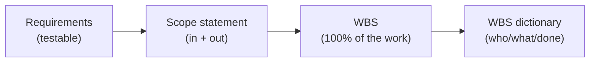
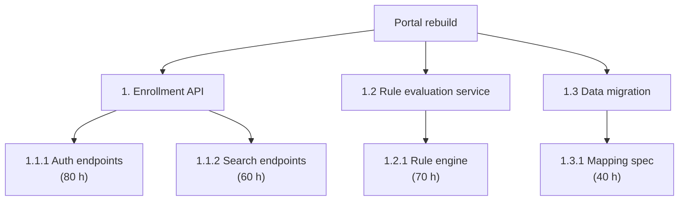

# L09 · Scope & Work Breakdown Structure

## If it is not in the WBS, it is not in the project

Week 5 · Unit U3 · CLO2 · 2 hours

<!-- _class: lead -->

---

## Learning objectives

1. **Collect** requirements that are testable, and write explicit exclusions
2. **Decompose** work into a deliverable-oriented, 100%-rule WBS
3. **Explain** what the WBS dictionary adds and why it prevents disputes
4. **Detect** scope creep from evidence, not vibes

<!-- notes: The quantitative core of the course starts here. CS-12 is the numeric WBS roll-up; Lab 3 builds the full 3-level WBS with hours. Timing ~5 min. -->

---

## Scope: requirements, exclusions, verification

- Requirement = **testable**: "result lookup < 5 s at 200 concurrent users" (L06's criterion, deepened)
- Exclusions are scope: "mobile app **excluded**; responsive web only" — written, not implied
- Verification = the test you will run at delivery, agreed **now**

<!-- notes: The flow is the teaching package's chain. Ask a student for a non-testable requirement and fix it live. 4 min. -->

---

## The WBS and the 100% rule

- **100% rule:** children sum to the parent — no gaps, no overlaps
- Decompose by **deliverable**, not by org chart or verb ("installing", "testing" are work, not deliverables)
- The dictionary: owner, description, acceptance, estimates per package

<!-- notes: Hours come from the teaching package's worked example — L10 will run PERT on packages 1.1.1/1.2.2, so keep these values stable. CS-12 verifies the roll-up. 6 min. -->

---

## CS / DS in the room

- **CS:** the student-portal rebuild — Lab 3's scenario; the 100% rule catches the missing "data migration" branch
- **DS:** a churn-model project WBS: data acquisition · feature engineering · modelling · **evaluation harness** — the branch teams forget
- CS-13: scope creep hides in a change log, not in a villain

<!-- notes: The evaluation-harness branch is the DS signature miss. CS-13 reads a change log for creep evidence — process-based, not person-based. 3 min. -->

---

## Case anchor:

**CS-12** — *Three-level WBS for the student portal*: verify the 100% rule numerically on the given hours
**CS-13** — *Scope-creep spotting from a change log*: classify each change as in-scope, formal change, or creep

<!-- notes: CS-12 in pairs (10 min, arithmetic), CS-13 as a table exercise. Keys: instructor/answer-keys/cases/CS-12.md, CS-13.md. Lab 3 extends CS-12 into the full dictionary. -->

---

## Discussion

1. Where does project management itself sit in the WBS — and why does the answer matter for the budget?
2. Can a WBS be too detailed? What does over-decomposition cost you?
3. Your sponsor says "also add reporting while you're in there". What exactly happens next?

<!-- notes: Q1 is a classic exam question (PM as its own branch or rolled into overhead — both defensible; defense is what's graded). Q3 previews L26 change control. 6 min. -->

---

## Summary & exit ticket

- Testable requirements + written exclusions + agreed verification = scope
- WBS by deliverables, children sum to parent (**100% rule**)
- The dictionary converts the WBS from a picture into a contract

**Exit ticket (2 min):** decompose one branch of your capstone to level 3, and mark where the 100% rule is currently violated.

<!-- notes: Tickets feed M1's WBS artifact. Remind: Lab 3 due this week; Quiz 2 at L12 covers L09–L12. -->

---

## References & next lecture

- PMI (2021) *PMBOK® Guide* 7th ed. — planning & delivery domains, scope practices
- Template: [`docs/templates/wbs-template.md`](../../docs/templates/index.md) · Lab 3: [`docs/labs/lab-03-scope-wbs.md`](../../docs/labs/index.md)
- Teaching package: `instructor/teaching-packages/U3-planning-the-work/L09-09-scope-wbs.md`
- **Next:** L10 — Estimation: why point estimates lie

<!-- notes: Preview L10 with the three-point estimation hook — bring the L09 package estimates forward. -->
