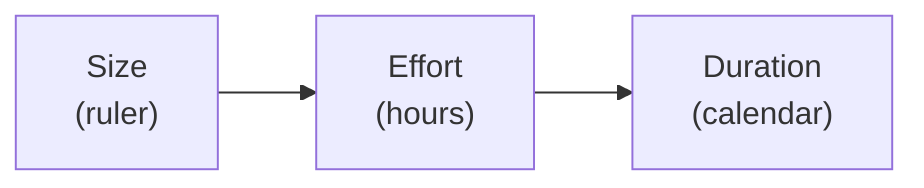

# L10 · Estimation: Size, Effort, Duration

## Point estimates lie; distributions and ranges tell the truth

Week 5 · Unit U3 · CLO2 · 2 hours

<!-- _class: lead -->

---

## Learning objectives

1. **Distinguish** size, effort, and duration — and the order they apply
2. **Compute** three-point (PERT) estimates with standard deviation
3. **Explain** why the *range* is the estimate, not a disclaimer
4. **Apply** provenance discipline: every number has a named source

<!-- notes: The PERT worked example is the board centerpiece — it reuses L09's package hours so the arithmetic chains forward into L13's budget. Timing ~5 min. -->

---

## Size → effort → duration

- **Size:** how big the work is (story points, function points, lines — any *stable ruler*)
- **Effort:** size × productivity (hours) — people-dependent
- **Duration:** effort ÷ allocation, with calendar reality (part-time ≠ full-time)

- Confusing size with duration is the beginner's error — 32 points is not "32 days"

<!-- notes: The order matters because each arrow loses precision. L21 will reuse this chain for sprint capacity. 4 min. -->

---

## Three-point estimation (PERT), fully worked

**Package 1.1.1 Enrollment API** (from L09): O = 60 h, M = 80 h, P = 150 h

| Step | Computation | Result |
|---|---|---|
| Expected value | t_E = (60 + 4·80 + 150) / 6 = 530 / 6 | **≈ 88.3 h** |
| Std deviation | sd = (150 − 60) / 6 | **15 h** |

**Package 1.2.2 Rule engine**: O = 50, M = 70, P = 110 → t_E = **73.3 h**, sd = 10 h

Path of the two (serial): E ≈ 161.7 h, sd = √(15² + 10²) = √325 ≈ 18 h
→ **≈ 95% range: 161.7 ± 36 ≈ 126–198 h**

<!-- notes: Walk it on the board exactly as the teaching package does. Lessons to say out loud: the range IS the estimate; the widest sd dominates; provenance of the 150 h ("if the auth interface turns hostile...") is part of the technique. 8 min. -->

---

## Why ranges, not points

- A point estimate has **zero** information about confidence — "88 h" is a number wearing a costume
- Summing O's or P's naively **overstates** the range (√ of sum-of-squares, not sum)
- Precision effort belongs on the **widest** distribution, not the loudest stakeholder

<!-- notes: The third bullet is the teaching package's live lesson 2. Bridge: these estimates feed the WBS dictionary, then the schedule (L11–L12), then the budget (L13). 3 min. -->

---

## CS / DS in the room

- **CS:** planning poker on a capstone backlog — calibration data shows optimists cluster at 3, realists at 8 (CS-14's setup)
- **DS:** estimating *data readiness* work — O/M/P on schema access and cleaning, where P is legitimately huge
- In DS, the riskiest distribution is almost always **data access**, not modelling

<!-- notes: The DS observation sets up L15's risk register — data-access risk becomes its first row. CS-14 runs as a calibration round. 3 min. -->

---

## Case anchor:

**CS-14** — *Planning-poker calibration for a capstone backlog*: play the round, compare to the historical conversion, defend your spread

<!-- notes: The case's numbers (32 pts, ~1.4 h/pt) are machine-verified and reused in L21's sprint-capacity arithmetic — keep them consistent when teaching. Key: instructor/answer-keys/cases/CS-14.md. -->

---

## Discussion

1. Your team's estimate is 88 h; your sponsor hears "two weeks". Where exactly did the meaning get lost?
2. When is it professional to give a range to management — and when is it evasion?
3. What would make you *reduce* a P value mid-project?

<!-- notes: Q2 is the judgment anchor — ranges with stated confidence are professional; vague hedges are not. 6 min. -->

---

## Summary & exit ticket

- Size → effort → duration, in that order; each arrow loses precision
- PERT: t_E = (O + 4M + P)/6 · sd = (P − O)/6 · path sd = √(Σsd²)
- The range is the estimate; provenance is part of the number

**Exit ticket (2 min):** give your capstone's riskiest package O, M, P — compute t_E and sd, and name the source of P.

<!-- notes: Tickets feed M1's estimation section. Lab 4 preview: the same discipline becomes network logic next lecture. -->

---

## References & next lecture

- PMI (2021) *PMBOK® Guide* 7th ed. — estimation practices (planning domain)
- Teaching package: `instructor/teaching-packages/U3-planning-the-work/L10-10-estimation.md`
- **Next:** L11 — Network Logic, CPM & PERT: find the critical path before it finds you

<!-- notes: Quiz 2 at L12 covers L09–L12; today's PERT mechanics and L11's CPM pass are its quantitative core. -->
