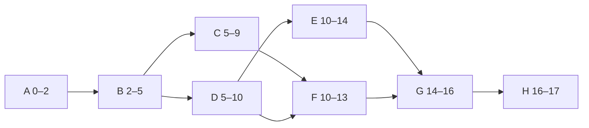

# L11 · Network Logic, CPM & PERT

## Find the critical path before it finds you

Week 6 · Unit U3 · CLO2 · 2 hours

<!-- _class: lead -->

---

## Learning objectives

1. **Draw** an activity-on-node network from a dependency table
2. **Execute** a complete forward and backward pass (ES/EF/LS/LF)
3. **Compute** total and free float, and identify all critical paths
4. **Explain** why "critical" is about float, not importance

<!-- notes: The hand-solved network is the deck's centerpiece and matches the teaching package and the checker exactly. Students do Lab 4 on the CAMPUS-MEND schedule this week. Timing ~5 min. -->

---

## From dependency table to network

| Activity | Predecessor | Dur (wk) |
|---|---|---|
| A Data audit | — | 2 |
| B Schema design | A | 3 |
| C Ingestion build | B | 4 |
| D Feature store | B | 5 |
| E Streaming features | D | 4 |
| F Model training | C, D | 3 |
| G Gate evidence | E, F | 2 |
| H Rollout | G | 1 |

All dependencies finish-to-start. Same table as the teaching package — Lab 4 uses CAMPUS-MEND's eight-package version.

<!-- notes: Keep this table identical to the package so pass arithmetic chains cleanly. Ask which activities merge branches (F, G) — merges are where float dies. 4 min. -->

---

## Forward pass

- **ES = max(EF of predecessors)** · **EF = ES + duration**
- Merge points: F takes max(9, 10) = **10** · G takes max(14, 13) = **14**
- Project EF = **17 weeks**

<!-- notes: Do it live, one node at a time, students calling the maxes. The node labels are ES–EF. 8 min on the board. -->

---

## Backward pass & float

**LF start = 17** · **LS = LF − duration** · **LF = min(LS of successors)**

| Act | ES–EF | LS–LF | Total float | Free float |
|---|---|---|---|---|
| A | 0–2 | 0–2 | 0 | 0 |
| B | 2–5 | 2–5 | 0 | 0 |
| C | 5–9 | 7–11 | **2** | **0** |
| D | 5–10 | 5–10 | 0 | 0 |
| E | 10–14 | 10–14 | 0 | 0 |
| F | 10–13 | 11–14 | **1** | **0** |
| G | 14–16 | 14–16 | 0 | 0 |
| H | 16–17 | 16–17 | 0 | 0 |

**Critical path: A→B→D→E→G→H = 17 weeks.** Note C and F: total float > 0 but free float = 0 — they can borrow time only from the project, not from their successors.

<!-- notes: The C/F free-float subtlety is exactly what the checker forced corrected in the answer keys — teach it explicitly. Near-critical F (TF=1) is Quiz 2 material. 8 min. -->

---

## Why "critical" ≠ "important"

- Critical = **zero float**: a 1-day slip moves the end date 1 day
- Non-critical work can be *more* important (H is rollout — tiny, critical; data governance might be huge, off-path)
- PERT adds distribution thinking: the critical path has its own variance — near-critical paths can **become** critical

<!-- notes: The near-critical-becomes-critical point is the bridge to L15's Monte Carlo lab (Lab 11). 3 min. -->

---

## CS / DS in the room

- **CS:** a microservice migration — the schema cutover (small, critical) vs the code rewrite (huge, float-rich)
- **DS:** model training looks long but has float; the **evaluation harness** it feeds has none — classic misread
- CS-15 is the 14-activity exam-grade version of today's 8-activity network

<!-- notes: The DS misread is the teaching package's misconception — students float-assume the glamorous work. 3 min. -->

---

## Case anchor:

**CS-15** — *Hand-solved 14-activity CPM network*: full pass with lags; verify the duration and find all zero-float paths (the key shows **three**)

<!-- notes: Numeric case — key is machine-verified by tools/check_cases.py. Assign as homework computation; Quiz 2 uses an 8-activity version of this exact pattern. Key: instructor/answer-keys/cases/CS-15.md. -->

---

## Discussion

1. Your sponsor wants the 17-week plan in 14. What are the only two legitimate levers — and what does each cost?
2. Which is worse: a critical activity slipping 1 day, or a TF=2 activity slipping 3?
3. How would Agile teams get the same visibility without a network diagram?

<!-- notes: Q1 previews crashing/fast-tracking (L12); Q3 previews the sprint-burndown answer (L21–L22). 6 min. -->

---

## Summary & exit ticket

- Forward: ES/EF · Backward: LS/LF · Float = LS − ES
- **Critical = zero float**, possibly several paths at once
- Free float ≠ total float — check your successors before borrowing

**Exit ticket (2 min):** compute total float of F if G's duration were 3 instead of 2 — and say which path becomes critical.

<!-- notes: The perturbation twist tests real understanding, not recall (answer: 16 weeks, F reaches TF=0 via the E route... wait — verify before announcing; see key). Correct answer in CS-15's key notes. -->

---

## References & next lecture

- PMI (2021) *PMBOK® Guide* 7th ed. — schedule model, CPM
- Lab 4 brief: [`docs/labs/lab-04-cpm-network.md`](../../docs/labs/index.md) · Key: `instructor/lab-solutions/lab-04-cpm-network-key.md`
- Teaching package: `instructor/teaching-packages/U3-planning-the-work/L11-11-cpm-pert.md`
- **Next:** L12 — Schedules, Gantt Charts & Resource Levelling (**Quiz 2 opens at the start of class, L09–L12**)

<!-- notes: The perturbation twist (verified): G at 3 weeks pushes EF(G) to 17 and the project to 18 weeks; the critical path is unchanged (A→B→D→E→G→H), F's total float stays 1 because the merge at G still runs through E. Have students verify on the board rather than asserting — model the verification habit. Quiz 2: instructor/exam-bank/quiz2.md. -->
