# L12 · Schedules, Gantt Charts & Resource Levelling

## From network logic to a working, resource-feasible schedule

Week 6 · Unit U3 · CLO2 · 2 hours

<!-- _class: lead -->

---

## Learning objectives

1. **Translate** a CPM network into a baselined Gantt chart
2. **Level** resources by moving float, and compute the calendar impact
3. **Distinguish** milestone discipline from milestone decoration
4. **Explain** why an unresourced schedule is not a schedule

<!-- notes: Quiz 2 (L09–L12, 15 min) runs FIRST — see instructor/exam-bank/quiz2.md. Today's levelling arithmetic comes from Lab 6's CAMPUS-MEND capacity numbers (already checker-verified). Timing ~5 min. -->

---

## Network → Gantt: the baseline

```mermaid
gantt
  title CAMPUS-MEND core schedule (weeks)
  dateFormat X
  axisFormat Week %s
  section Build
  A Legacy audit (2w)      :a1, 0, 2w
  B Schema design (3w)     :a2, after a1, 3w
  C Portal build (4w)      :a3, after a2, 4w
  D Analytics repo (5w)    :a4, after a2, 5w
  E Pipeline (4w)          :a5, after a4, 4w
  F LMS adapter (3w)       :a6, after a3, 3w
  section Close
  G Testing (2w)           :a7, after a5, 2w
  H Rollout (1w)           :a8, after a7, 1w
```

- The baseline is **frozen**: it is the ruler you measure slippage against (L19's PV comes from here)
- Milestones = zero-duration decision points with owners — not Fridays

<!-- notes: The Gantt block mirrors the CAMPUS-MEND §A schedule (docs/labs/data-pack.md) — G after E here is the simplified teaching chain; Lab 6's full version includes the C,F predecessor. Say that difference out loud to avoid confusion. 5 min. -->

---

## Resource levelling: the arithmetic

**CAMPUS-MEND pattern (Lab 6, verified):** two testers, 40 h/wk each — during testing (2 wks) they need **80 h/wk** of work each?

No — the correct read: testing needs **160 h total**; two testers × 40 h/wk × 2 wks = **160 h ✓ fits exactly**

But B needs **two** developers in parallel while only one is free after A:

| Week | Demand | Capacity | Action |
|---|---|---|---|
| 3–5 | 2 devs (B needs both) | 1 dev | B slips — or split B |

- Levelling within float = free · beyond float = **the end date moves**

<!-- notes: The two-tester capacity correction is one the checker caught in the lab keys — teach the exact-fit vs over-fit distinction. The B-dev demand is the classic levelling crunch. 6 min, board arithmetic. -->

---

## CS / DS in the room

- **CS:** one senior reviewer across three code streams — levelling the review float decides the release date
- **DS:** one GPU cluster for two training jobs — levelling = scheduling queue, and the crunch lands on the deadline
- Shared-resource contention is the DS studio's normal state, not an exception

<!-- notes: The GPU queue example lands with the DS cohort — connect to CS-16's levelling decisions. 3 min. -->

---

## Case anchor:

**CS-16** — *Gantt baseline and resource levelling*: baseline the CAMPUS-MEND schedule, find the over-allocation, and choose: split, slip, or add capacity?

<!-- notes: Qualitative decision case — three defensible answers; the key grades the trade-off analysis, not the choice. Key: instructor/answer-keys/cases/CS-16.md. Lab 6 (docs/labs/lab-06-gantt-resources.md) is the numeric version. -->

---

## Discussion

1. What is lost when a schedule is levelled purely by software? What must the human still decide?
2. Your critical resource is a person, not a machine. Which levelling options disappear?
3. Why does the baseline freeze feel bureaucratic *right up until* it saves the project?

<!-- notes: Q1's expected direction: tools optimize one metric; humans own trade-offs and politics. 6 min. -->

---

## Summary & exit ticket

- Gantt = network + calendar + resources; the baseline is the measurement ruler
- Levelling inside float is free; beyond float, the **end date moves**
- Milestones are decisions with owners, not Fridays

**Exit ticket (2 min):** in your capstone, name one over-allocated resource and whether you would split, slip, or add — with the week number you'd move.

<!-- notes: Tickets feed M2's schedule artifact (due at L12 per the capstone milestone plan). -->

---

## References & next lecture

- PMI (2021) *PMBOK® Guide* 7th ed. — schedule & resource domains
- Template: [`docs/templates/gantt-template.csv`](../../docs/templates/index.md) · Lab 6: [`docs/labs/lab-06-gantt-resources.md`](../../docs/labs/index.md)
- Teaching package: `instructor/teaching-packages/U3-planning-the-work/L12-12-schedule-tools.md`
- **Next:** L13 — Cost Estimating & Budgeting: from hours to a controllable money plan

<!-- notes: Preview L13 with the labor→overhead→contingency build; its CampusHub numbers chain into L19's EVM lecture. -->
