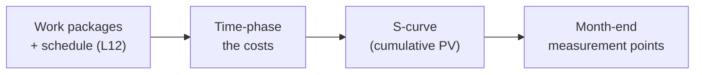

# L13 · Cost Estimating & Budgeting

## From activity costs to a time-phased, controllable budget

Week 7 · Unit U3 · CLO2 · 2 hours

<!-- _class: lead -->

---

## Learning objectives

1. **Build** a bottom-up budget from labor, direct costs, overhead, and contingency
2. **Distinguish** cost baseline from budget (and where management reserve lives)
3. **Explain** what the S-curve is for and how it becomes PV (L19)
4. **Audit** a budget line for hidden assumptions

<!-- notes: Every number on the arithmetic slide is checker-verified (check_answers.py recomputes the chain from role hours). The baseline $64,424 is the anchor L19 reuses — keep it exact. Timing ~5 min. -->

---

## Bottom-up: labor first

**Rates:** developers $45/h · data engineer $50/h · overhead 60% of labor

| Role | Hours | Rate | Cost |
|---|---|---|---|
| Developers (3 × 280 h) | 840 | $45 | $37,800 |
| Data engineer | 200 | $50 | $10,000 |
| PM (15% of team effort) | 155 | $45 | $6,975 |
| **Labor subtotal** | | | **$54,775** |

- PM effort is *planned*, not donated — the most common omission in student budgets

<!-- notes: The PM-effort point is the teaching package's misconception #1. These role hours roll up to $3,225,600 PKR in the CAMPUS-MEND key — the checker verifies both currencies' chains. 5 min. -->

---

## Direct costs → baseline → budget

| Step | Computation | Result |
|---|---|---|
| Direct costs (license, GPU, storage, egress) | 2,400 + 264 + 828 + 300 | **$3,792** |
| Subtotal | 54,775 + 3,792 | **$58,567** |
| Contingency (10%) | 0.10 × 58,567 | **$5,857** |
| **Cost baseline** | | **$64,424** |
| Management reserve (5%, sponsor-held) | — | **outside the baseline** |

- **Baseline = what PM controls** · Budget = baseline + reserve
- Contingency covers *identified* risks; reserve covers the *unknown* ones

<!-- notes: The contingency/reserve split is a recurring exam item (QB-U3, final exam). The $64,424 becomes L19's BAC verbatim — say that explicitly so students see the chain. 6 min. -->

---

## The S-curve: time-phasing the baseline

- Flat curve = work back-loaded; steep = front-loaded — both are **choices with risks**
- The S-curve is not decoration: it **is** the PV line L19 measures against

<!-- notes: Preview the measurement connection — students who see the S-curve as accounting art miss that EVM needs it. 4 min. -->

---

## CS / DS in the room

- **CS:** a mobile-app budget that forgot app-store fees and device-lab time — direct costs, not labor
- **DS:** GPU hours are the classic DS direct cost — and the classic place where "it's just compute" hides 20% of budget
- CS-17: a data-project budget where the labor roll-up must be recomputed, not trusted

<!-- notes: The GPU point ties to Lab 7's direct-cost section. CS-17 is the numeric audit case. 3 min. -->

---

## Case anchor:

**CS-17** — *Bottom-up budget for a data project*: audit the labor roll-up (2,100,000 PKR — the stated figure hides an error), rebuild the baseline, and defend your contingency rate

<!-- notes: Numeric case, machine-verified: labor = 420×2600 + 300×2400 + 160×1800 = 2,100,000; the chain cascades through contingency to the baseline. Key: instructor/answer-keys/cases/CS-17.md. Lab 7 is the CAMPUS-MEND version. -->

---

## Discussion

1. Who should own the management reserve — and what behavior does that ownership create?
2. Contingency is 10%. Your sponsor says "make it 5% and we're approved." What is your professional response?
3. Which is more dangerous: a budget without an S-curve, or a schedule without a budget?

<!-- notes: Q2 is an ethics-adjacent negotiation seed (L24's skills apply). Expected: re-derive contingency from the risk register, not negotiate the percentage. 6 min. -->

---

## Summary & exit ticket

- Budget = labor + direct + overhead + contingency (**baseline**) + reserve (**sponsor-held**)
- The S-curve time-phases the baseline — it becomes EVM's PV
- Contingency answers identified risks; reserve answers unknown ones

**Exit ticket (2 min):** your capstone labor is 300 h at $40/h with 60% overhead. Compute labor+overhead, then the baseline at 10% contingency.

<!-- notes: Answer for the instructor: 300×40 = 12,000; +60% = 19,200; ×1.10 = 21,120. Formative; feeds M2's cost artifact. -->

---

## References & next lecture

- PMI (2021) *PMBOK® Guide* 7th ed. — cost domain practices
- Template: [`docs/templates/cost-baseline-template.csv`](../../docs/templates/index.md) · Lab 7: [`docs/labs/lab-07-cost-baseline.md`](../../docs/labs/index.md)
- Teaching package: `instructor/teaching-packages/U3-planning-the-work/L13-13-cost-budget.md`
- **Next:** L14 — Quality & Data-Quality Planning: quality is planned in, not inspected in

<!-- notes: Preview L14 with the DS-specific twist: for this cohort, data quality IS quality management. -->
