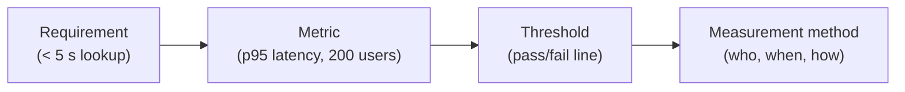

# L14 · Quality & Data-Quality Planning

## Quality is planned in, not inspected in — including data quality

Week 7 · Unit U3 · CLO2 · 2 hours

<!-- _class: lead -->

---

## Learning objectives

1. **Write** quality metrics with thresholds before delivery starts
2. **Classify** costs of quality (prevention, appraisal, internal/external failure)
3. **Define** data-quality dimensions and enforce them as executable rules
4. **Argue** why quality planning is the cheapest quality work you will ever do

<!-- notes: This lecture is the DS cohort's bridge into governance territory (returns at L27). CS-19's eight rules are the practical centerpiece. Timing ~5 min. -->

---

## From requirements to quality metrics

- A metric without a threshold is a wish; a threshold without a method is a fight waiting to happen
- Cost of quality: **prevention** (cheap) → **appraisal** → **internal failure** → **external failure** (a 100× climb, roughly)

<!-- notes: The 4-step chain is from the teaching package. The 100× claim: present as the package's rough industry ratio, not a law. 4 min. -->

---

## Data quality: six dimensions, executable rules

| Dimension | Rule example (customer dataset) |
|---|---|
| Completeness | phone present in ≥ 98% of active rows |
| Validity | `signup_date <= today` for every row |
| Uniqueness | customer_id duplicated in ≤ 0.1% of rows |
| Consistency | `churn_date` implies `status = churned` |
| Timeliness | feed refreshed within 24 h of source |
| Accuracy | 2% sample re-verified monthly |

*(Dimension set follows the classic completeness/validity/uniqueness/consistency/timeliness/accuracy model used in the teaching package)*

- **CS-19's exercise:** turn eight vague complaints into eight executable rules
- A rule you cannot run in SQL/validation code is a hope, not a rule

<!-- notes: The complaint→rule conversion is CS-19's core skill and directly feeds the responsible-AI agenda (L27). Ask: which dimension does a duplicate-row bug violate? (uniqueness AND consistency — good argument material.) 6 min. -->

---

## CS / DS in the room

- **CS:** a registration system where "tested" meant "the demo worked once" — CS-18 fixes metrics with thresholds
- **DS:** the churn model trained on a 4%-duplicated dataset — every downstream metric was quietly wrong; the failure was **quality planning**, not modelling
- Data quality defects are external failures by the time anyone notices them

<!-- notes: The churn example is the teaching package's DS anchor. Connect: this is why L27 treats data governance as a project-management topic, not an IT chore. 3 min. -->

---

## Case anchor:

**CS-18** — *Quality metrics for a registration system*: write metric + threshold + method for five vague requirements
**CS-19** — *Eight data-quality rules for a customer dataset*: convert complaints into executable rules with owners

<!-- notes: CS-18 in pairs, CS-19 as a table exercise — both feed Lab 8 (quality plan). Keys: instructor/answer-keys/cases/CS-18.md, CS-19.md. Quiz 3 (L26) will reuse the cost-of-quality ladder. -->

---

## Discussion

1. Who should *own* a data-quality rule: the data engineer, the analyst, or the data owner from L07?
2. Is 100% data quality ever the right target? What would it cost?
3. Your model's accuracy drops after a source-schema change. Which quality dimension failed — and which *process*?

<!-- notes: Q1 ties back to L07's RACI/ownership discussion; Q3's expected answer: consistency (technical) with timeliness (process) — the process answer is the graded one. 6 min. -->

---

## Summary & exit ticket

- Metric → threshold → method, agreed before delivery
- Prevention is the cheapest quality work; external failure is the most expensive lesson
- Data quality = dimensions turned into executable, owned rules

**Exit ticket (2 min):** write one executable data-quality rule for your capstone's dataset — dimension, threshold, owner.

<!-- notes: Tickets feed M2's quality artifact. U3 closes here; U4 opens with risk. Remind: Assignment 1 (scope & schedule) is due after L16 per the syllabus. -->

---

## References & next lecture

- PMI. (2021). *PMBOK® Guide* (7th ed.) — Quality principle; Measurement & Delivery domains
- PMI. (2017). *PMBOK® Guide* (6th ed.) — "Plan Quality Management" (cost-of-quality taxonomy)
- Template: [`docs/templates/quality-plan-template.md`](../../docs/templates/index.md) · Lab 8: [`docs/labs/lab-08-quality-plan.md`](../../docs/labs/index.md)
- Teaching package: `instructor/teaching-packages/U3-planning-the-work/L14-14-quality-data-quality.md`
- **Next:** L15 — Risk Management: naming the unknowns before they name themselves (Unit U4 opens)

<!-- notes: ISO/IEC 25012 grounds the six dimensions — check it is in the syllabus reference list (it is, per QB-U3). Preview L15 with the P×I matrix. -->
