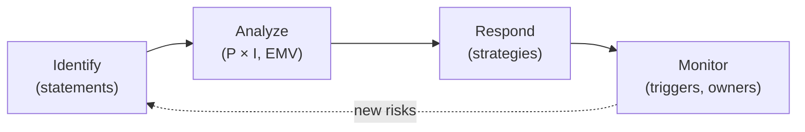

# L15 · Risk Management Foundations (ISO 31000 Alignment)

## Identify early, quantify honestly, respond deliberately

Week 8 · Unit U4 · CLO4 · 2 hours

<!-- _class: lead -->

---

## Learning objectives

1. **Run** the risk process: identify → analyze → respond → monitor, as a loop
2. **Write** risk statements with cause, event, and effect (no vibes, no villains)
3. **Score** risks on a probability–impact matrix with declared thresholds
4. **Compute** expected monetary value and defend its limits

<!-- notes: Unit U4 opens; the P×I matrix slide carries CS-21's machine-verified scores — keep them exact. Risk register structure feeds Lab 9. Timing ~5 min. -->

---

## The risk process is a loop

- ISO 31000 framing: risk = **effect of uncertainty on objectives** — threats *and* opportunities
- A risk register row: ID · statement · P · I · score · response · owner · trigger

<!-- notes: The opportunities half of ISO's definition is new to most students — one example each. The loop arrow matters: monitoring generates new identifications. 4 min. -->

---

## Risk statement anatomy

- Bad: "The API might be a problem"
- Good: "**Because** the vendor releases schema changes monthly ****(cause)**, the **ingestion pipeline may break on release day (event)**, **causing up to 3 days of stale analytics (effect)**"

- Cause → event → effect: each part is attackable, so each part is improvable
- Owner ≠ volunteer: the owner has the authority to act (L04's RACI returns)

<!-- notes: Rewrite one student risk live using the template. The authority point ties to L04 — owners without authority are spectators. 4 min. -->

---

## The P×I matrix — with real thresholds

| Risk | P | I | Score | Band |
|---|---|---|---|---|
| R1 Vendor schema change | 0.4 | 30 | **12** | medium |
| R2 Data-access denial | 0.2 | 80 | **16** | high |
| R3 Key-person loss | 0.5 | 20 | **10** | medium |
| R5 GPU price spike | 0.1 | 50 | **5** | low |

Bands (declared): low < 6 ≤ medium < 15 ≤ high · **EMV = P × I** (PKR): R2 = 1,000,000 — the top exposure; **total EMV = 2,365,000**

<!-- notes: Scores are CS-21's, checker-verified. The teaching point: R2 is LOW probability but tops EMV — heat maps alone would have buried it. That is CS-21's whole argument. 6 min. -->

---

## CS / DS in the room

- **CS:** a streaming-platform launch — twenty risks named in CS-20, from CDN contract to launch-day support staffing
- **DS:** data-access denial (R2) is the recurring DS exposure — legal/consent, not technical; it outranks every technical risk on EMV
- If your risk register has no *non-technical* top row, you have not looked hard enough

<!-- notes: The last line is the assessment sentence. Lab 9 starts from this register. 3 min. -->

---

## Case anchor:

**CS-20** — *Twenty risks for a streaming platform*: identification sprint — breadth first, no filtering yet
**CS-21** — *Heat-map thresholds on trial*: the same scores, two threshold schemes — watch the top risk change bands

<!-- notes: CS-20 as a timed hunt (15 min), CS-21 as the threshold debate. Key insight (verified): thresholds are policy, not physics — the key grades the defense. Keys: instructor/answer-keys/cases/CS-20.md, CS-21.md. -->

---

## Discussion

1. Who should *declare* the P×I thresholds — the PM, the sponsor, or the PMO? Why does it change behavior?
2. EMV assumes the impact estimate is honest. How would you audit an EMV?
3. When is it rational to accept a high-band risk?

<!-- notes: Q2 previews L18 (procurement data) and Lab 10; Q3's expected answer: when response cost exceeds EMV — and that's a documented decision, not silence. 6 min. -->

---

## Summary & exit ticket

- Risk = effect of uncertainty on objectives — threats **and** opportunities
- Statements have cause → event → effect; owners have authority
- P×I with declared thresholds; **EMV = P × I** ranks what heat maps hide

**Exit ticket (2 min):** write your capstone's riskiest data-related risk as cause–event–effect, and estimate its EMV with a stated P.

<!-- notes: Tickets feed M2's risk register. Preview L16: when P and I themselves are uncertain — distributions, trees, simulation. -->

---

## References & next lecture

- ISO 31000:2018 — *Risk management: Guidelines*
- PMI (2021) *PMBOK® Guide* 7th ed. — uncertainty domain
- Template: [`docs/templates/risk-register-template.md`](../../docs/templates/index.md) · Lab 9: [`docs/labs/lab-09-risk-register.md`](../../docs/labs/index.md)
- Teaching package: `instructor/teaching-packages/U4-risk-uncertainty-control/L15-15-risk-foundations.md`
- **Next:** L16 — Quantitative Risk: PERT, Trees & Simulation

<!-- notes: ISO 31000 is the syllabus-aligned frame for this lecture (course-data lists ISO 31000 for L15). Preview L16 with 'what if P is itself a distribution?'. -->
