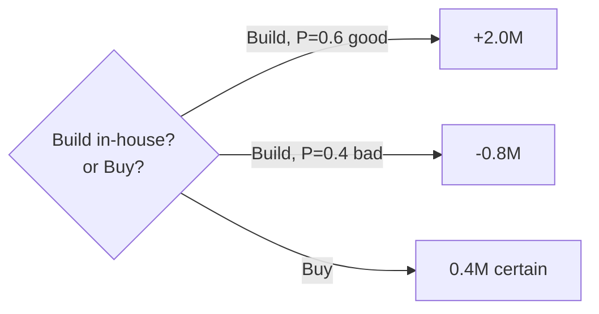
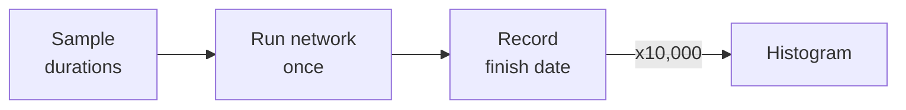

# L16 · Quantitative Risk: PERT, Trees & Simulation

## Monte Carlo for schedules and budgets — without fear

Week 8 · Unit U4 · CLO4 · 2 hours

<!-- _class: lead -->

---

## Learning objectives

1. **Build** a decision tree with EMV at each node and explain the fold-back
2. **Explain** what a Monte Carlo run actually does — samples, not magic
3. **Read** a schedule histogram: median, P70, and the tail that hurts
4. **Justify** contingency from simulation output, not from folklore

<!-- notes: Lab 11 runs the deterministic seeded simulation — today's deck gives it the theory. All histogram numbers on the slide are CS-22's checker-verified values. Timing ~5 min. -->

---

## Decision trees: fold back the EMV

- In-house EMV = 0.6 × 2.0 + 0.4 × (−0.8) = **+0.88M** vs buy = **0.4M** → build *wins on average*
- Fold-back answers "*if we are risk-neutral*" — the debate is whether you are

<!-- notes: The risk-neutrality caveat is the teaching package's key discussion — a cash-poor sponsor may rationally buy. The tree is the deck's one non-Mermaid visual spot... actually keep it Mermaid for consistency. 5 min. -->

---

## Monte Carlo: what the machine actually does

1. Sample every activity duration from its **distribution** (L10's O/M/P)
2. Run the network → one simulated finish date
3. Repeat 10,000× → a **distribution** of finish dates

- The critical path can **change between runs** — L11's near-critical path (TF=1) becomes critical in many trials

<!-- notes: This connects directly to L11's F-activity subtlety — students now see why float ranks can flip. Lab 11's script does exactly this with a fixed seed. 5 min. -->

---

## Reading the histogram (CS-22, verified)

| Statistic | Value | Meaning |
|---|---|---|
| Trials finished on time | 6,400 / 10,000 | **P(on time) = 0.64** |
| Median finish | week **16** | half the runs land here or earlier |
| Mean overrun *when late* | **1.583 wk** | lateness averages ~1.6 weeks |
| Mean overrun *all trials* | **0.57 wk** | the honest expectation |
| P70 bracket | week **17** | target for a 70% confidence date |

- **0.57 ≠ 1.583** — quoting the conditional mean when you mean the unconditional one is the classic statistical lie

<!-- notes: Every number is checker-verified. The conditional-vs-unconditional distinction is the statistics teaching point of the year for this cohort — CS-22's whole argument. 6 min. -->

---

## CS / DS in the room

- **CS:** a launch-date promise built on the median instead of P70 — the 30% who miss are your support team's nightmare
- **DS:** the same tool prices *data-readiness* contingency: sample the cleaning-effort distribution, watch the tail
- Simulation is estimation about estimates — it inherits every O/M/P bias you fed it

<!-- notes: The garbage-in caveat is the assessment-level understanding: simulation does not rescue bad elicitation. 3 min. -->

---

## Case anchor:

**CS-22** — *Monte Carlo on a class schedule*: the histogram above is your input; derive P(on time), the P70 date, and defend a contingency week count

<!-- notes: Numeric case, checker-verified. Lab 11 (docs/labs/lab-11-monte-carlo.md) re-runs it with the seeded script (tools/campus_mend_sim.py). Key: instructor/answer-keys/cases/CS-22.md. -->

---

## Discussion

1. Your sponsor asks for "the date, not a distribution." What do you say — and what do you put in writing?
2. When would a decision tree's EMV ranking be *wrong* to follow?
3. Why does 10,000 trials beat 10? What exactly improves?

<!-- notes: Q1's expected answer: give the P70 date with the P(on-time) attached — professional confidence communication (L18 comms links). Q2: risk-aversion, unmodeled costs, one-shot projects. 6 min. -->

---

## Summary & exit ticket

- Decision trees fold back EMVs — under an explicit risk-neutrality assumption
- Monte Carlo = sample → run → repeat; distributions, not dates
- Report P70, not the median; conditional ≠ unconditional means

**Exit ticket (2 min):** your P(on time) is 0.64. Name the date you would *commit* to, and the sentence you would say to the sponsor.

<!-- notes: The professional sentence should reference the confidence level — that phrasing is the formative target. U4 continues with responses next lecture. -->

---

## References & next lecture

- ISO 31000:2018 — risk assessment (analysis & evaluation steps)
- PMI (2021) *PMBOK® Guide* 7th ed. — uncertainty domain, quantitative analysis
- Lab 11 brief: [`docs/labs/lab-11-monte-carlo.md`](../../docs/labs/index.md) · Simulator: `tools/campus_mend_sim.py`
- Teaching package: `instructor/teaching-packages/U4-risk-uncertainty-control/L16-16-quant-risk-simulation.md`
- **Next:** L17 — Risk Responses, Issues & Reserves: who owns what, and who pays

<!-- notes: Preview L17 with the response-strategy table and the reserve question from L13 returning in full. -->
