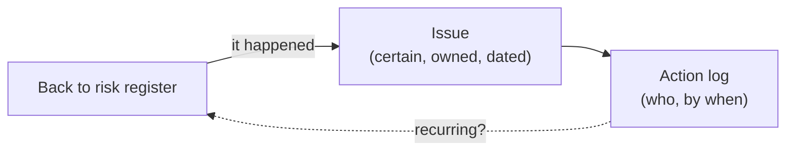

# L17 · Risk Responses, Issues & Reserves

## Strategies for threats and opportunities — and who owns each one

Week 9 · Unit U4 · CLO4 · 2 hours

<!-- _class: lead -->

---

## Learning objectives

1. **Match** response strategies to threats and opportunities — and defend the match
2. **Distinguish** a risk from an issue (and why the register split matters)
3. **Allocate** contingency and management reserves to the right owners
4. **Write** response plans with triggers, owners, and costs

<!-- notes: The response table is the lecture's spine; CS-23 applies it to the top ten risks from CS-20's register. Assignment 2 (risk register) releases after L17 per the syllabus. Timing ~5 min. -->

---

## The response playbook

| Threats | Opportunities |
|---|---|
| **Avoid** — change the plan so it can't happen | **Exploit** — make it certain |
| **Mitigate** — reduce P or I | **Enhance** — raise P or I |
| **Transfer** — move it (insurance, contract) | **Share** — partner for the upside |
| **Accept** — document, watch, no action | **Accept** — take the free upside |

- Every response has a **cost** — including acceptance (the watch hours)
- A response without a **trigger** is a wish with a deadline

<!-- notes: The trigger point is the package's misconception #2 — 'monitor' is a real strategy with real hours. Ask which strategy a fixed-price contract is (transfer — and CS-24 will complicate that). 5 min. -->

---

## Risk vs issue: the register split

- Issues do not get probabilities — they get **owners and dates**
- A risk that fires twice is a *process defect* wearing a costume — back to the register with a structural response

<!-- notes: The recurring-risk point is the teaching package's live lesson. Connect to L20: issue aging is a control signal. 4 min. -->

---

## Reserves: who holds which money

| Reserve | Covers | Held by | Baseline? |
|---|---|---|---|
| Contingency | identified risks (EMV-derived) | PM | **in** the baseline |
| Management reserve | unknown-unknowns | sponsor | **out** (L13) |

- Contingency is spent *through change control* — not on a first-come basis
- Depleting contingency early is a **schedule** message too: re-forecast EAC (L19 next lecture)

<!-- notes: The change-control discipline for contingency spend links L13 and L20. Bridge sentence: next lecture gives you the number set that shows whether the spend worked. 4 min. -->

---

## CS / DS in the room

- **CS:** a launch-platform DDoS risk — mitigate (CDN) vs transfer (cloud shielding SLA) vs accept (hope) — priced in the case
- **DS:** an *opportunity* register entry: a public dataset release could add a benchmark — exploit/share with the university lab
- Opportunity registers are not decoration: they are where DS projects find their headline results

<!-- notes: The DS opportunity example lands the ISO definition from L15 — full circle. 3 min. -->

---

## Case anchor:

**CS-23** — *Response plans for the top ten risks*: strategy + trigger + owner + cost for each; defend two transfers and one acceptance

<!-- notes: Qualitative case; the key grades completeness (trigger/owner/cost) and the defense of acceptance decisions. Key: instructor/answer-keys/cases/CS-23.md. Assignment 2 brief releases today. -->

---

## Discussion

1. Insurance transfers risk — does it *reduce* it? What does the insurer's price tell you about your EMV?
2. Can a mitigation be worse than the risk? Construct one.
3. Who should sign off an 'accept' decision on a high-band risk?

<!-- notes: Q1's expected direction: price signals the insurer's (better-calibrated) EMV plus margin — a free calibration check. 6 min. -->

---

## Summary & exit ticket

- Four strategies per side; every one costs something — including watching
- Issues get owners and dates; recurring issues are structural defects
- Contingency = identified risks, PM-held, spent via change control

**Exit ticket (2 min):** take one risk from your capstone register and write its response line: strategy, trigger, owner, cost.

<!-- notes: Tickets feed Assignment 2 directly — the A2 rubric's response column matches this format. -->

---

## References & next lecture

- ISO 31000:2018 — risk treatment
- PMI (2021) *PMBOK® Guide* 7th ed. — uncertainty domain, responses
- Template: [`docs/templates/risk-register-template.md`](../../docs/templates/index.md) · Assignment 2: [`docs/assignments/a2-risk-register.md`](../../docs/assignments/index.md)
- Teaching package: `instructor/teaching-packages/U4-risk-uncertainty-control/L17-17-risk-response.md`
- **Next:** L18 — Procurement & Vendor Management: buying well as a project skill

<!-- notes: Preview L18 with the contract-type selection: fixed price, T&M, FPIF — CS-24/CS-25 both land there. -->
