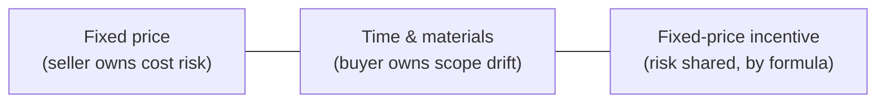

# L18 · Procurement & Vendor Management

## Buying well is a project skill — contracts, cloud, and outsourcing

Week 9 · Unit U4 · CLO4 · 2 hours

<!-- _class: lead -->

---

## Learning objectives

1. **Choose** among fixed-price, T&M, and incentive contracts — and say what each transfers
2. **Compute** an FPIF price ceiling, point of total assumption, and fee at any cost
3. **Write** SLA acceptance criteria with measurable bands and penalties
4. **Explain** why the contract is a risk-response instrument (L17's transfer, made concrete)

<!-- notes: Both numeric slides use checker-verified values from CS-24/CS-25 — the POTA convention (buyer's share) is a known PMP trap and is taught explicitly. Timing ~5 min. -->

---

## Three contracts, three risk postures

- **FP:** best when scope is fixed — and sellers price the uncertainty in
- **T&M:** best for exploratory work — and drift is *your* budget line
- **FPIF:** shares cost risk by formula — the exam's favorite arithmetic

<!-- notes: Ask which contract L10's estimation uncertainty would push you toward (T&M or incentive — never FP on a wide O/M/P range). 4 min. -->

---

## FPIF, fully worked (CS-24, verified)

**Terms:** target cost 800,000 · target fee 80,000 · buyer share 80/20 · ceiling price 950,000

| Step | Computation | Result |
|---|---|---|
| Target price | 800,000 + 80,000 | **880,000** |
| POTA | (950,000 − 880,000) / 0.8 + 800,000 | **887,500** |
| Fee at cost 900,000 | 80,000 − 0.2 × (900,000 − 800,000) | **50,000** |
| Price at cost 900,000 | 900,000 + 50,000 | **950,000** |
| Price at cost 1,000,000 | past POTA → | **950,000 (ceiling)** |

- Past the point of total assumption, **every extra rupee is the seller's** — that is why sellers walk away at the POTA

<!-- notes: All values machine-verified. The buyer's-share convention (80% here) is the trap CS-24 was corrected to teach — spend a full minute on it. 7 min, board. -->

---

## SLA acceptance criteria (CS-25, verified)

**ML-API vendor:** 99.5% availability monthly · measured 99.2%

| Step | Computation | Result |
|---|---|---|
| Allowed downtime | 0.005 × 43,200 min | **216 min** |
| Actual downtime | 0.008 × 43,200 min | **345.6 min** |
| Shortfall | 345.6 − 216 = 129.6 min → band 3 | **band 3** |
| Penalty | band 3 = 120,000 PKR | **120,000** |

- Criteria must name the **measurement window**, the **band boundaries**, and the **payment mechanism** — or the penalty is a wish

<!-- notes: The three named elements are what CS-25's key grades. Connect back: this is L17's transfer strategy with its teeth. 5 min. -->

---

## CS / DS in the room

- **CS:** outsourcing a mobile build on FP — the vendor's change-request pricing is the real contract
- **DS:** cloud GPU commitments (T&M in disguise) and ML-API vendors (SLA-driven) — procurement is where DS budgets are won or lost
- Data-processing agreements are procurement documents: consent, retention, cross-border transfer (L27 links)

<!-- notes: The DPA point seeds L27's governance lecture. The GPU-commitment trap (paying for idle reserved capacity) is the DS signature budget leak. 3 min. -->

---

## Case anchor:

**CS-24** — *Contract-type selection scenarios*: five procurement decisions with cost ranges and ambiguity levels
**CS-25** — *SLA acceptance criteria for an ML API vendor*: write the bands, then compute the penalty you can actually enforce

<!-- notes: CS-24 decision-first (numeric verification in key), CS-25 numeric-first. Keys: instructor/answer-keys/cases/CS-24.md, CS-25.md. Both are Intermediate/Advanced band. -->

---

## Discussion

1. Why might a vendor *decline* work priced past the POTA — and should you let them?
2. Your SLA says "99.5% excluding scheduled maintenance." Who defines 'scheduled' — and when?
3. When is T&M the *ethical* choice, not just the convenient one?

<!-- notes: Q3's expected direction: exploratory work with honest uncertainty — FP on unknown scope invites corner-cutting. 6 min. -->

---

## Summary & exit ticket

- Contract type = risk-posture choice; FPIF shares risk by formula
- POTA = (ceiling − target price) / buyer share + target cost; past it, the seller bleeds
- SLA criteria: window, bands, payment mechanism — or unenforceable

**Exit ticket (2 min):** target cost 500,000, fee 50,000, 60/40 buyer share, ceiling 600,000 — compute the POTA.

<!-- notes: Answer: (600,000 − 550,000)/0.6 + 500,000 = 583,333. Formative; matches CS-24's method exactly. -->

---

## References & next lecture

- PMI (2021) *PMBOK® Guide* 7th ed. — procurement practices (project work domain)
- Teaching package: `instructor/teaching-packages/U4-risk-uncertainty-control/L18-18-procurement.md`
- **Next:** L19 — Earned Value Management: one number set for cost AND schedule health

<!-- notes: Preview L19 with the CampusHub chain: BAC 64,424 from L13 — the whole lecture runs on that baseline. Midterm window opens soon (L01–L20 coverage). -->
