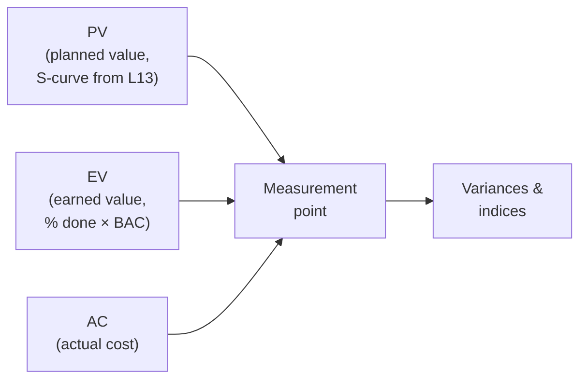

# L19 · Earned Value Management

## One number set that tells you cost AND schedule health

Week 10 · Unit U4 · CLO4 · 2 hours

<!-- _class: lead -->

---

## Learning objectives

1. **Compute** PV, EV, AC, CV, SV, CPI, SPI from a status snapshot
2. **Choose** the right EAC formula for the story the variances tell
3. **Interpret** TCPI as the discipline required from here
4. **Diagnose** a troubled project from four numbers — then verify with evidence

<!-- notes: Every number below is the CampusHub month-4 chain, checker-verified in check_answers.py (BAC 64,424 from L13). The midterm's EVM section uses this exact pattern. Timing ~5 min. -->

---

## The EVM machine: three inputs

- **EV is the trick**: it values work by *what you planned to pay for it*, not what it cost
- Month 4 (CampusHub): PV = 38,400 · EV = 31,900 · AC = 36,700

<!-- notes: The EV-not-AC point is the conceptual gate — students who miss it compute nothing else right. 4 min. -->

---

## The full computation (CampusHub, month 4)

| Metric | Computation | Value | Reading |
|---|---|---|---|
| CV | 31,900 − 36,700 | **−4,800** | over cost |
| SV | 31,900 − 38,400 | **−6,500** | behind schedule |
| CPI | 31,900 / 36,700 | **0.87** | $0.87 value per $1 spent |
| SPI | 31,900 / 38,400 | **0.83** | moving at 83% of plan |
| EAC₁ (typical) | 64,424 / 0.87 | **≈ 74,050** | inefficiency persists |
| EAC₂ (atypical) | 36,700 + 32,524 | **69,224** | one-off pain |
| EAC₃ (both persist) | 36,700 + 32,524/(0.87×0.83) | **≈ 81,780** | compounding trouble |
| TCPI (to BAC) | 32,524 / 27,724 | **1.17** | must run CPI 1.17 from now |

<!-- notes: Walk the table row by row on the board — this is the exam's centerpiece and the check_answers.py chain. Emphasize EAC choice as a NARRATIVE decision: which story do the variances support? 9 min. -->

---

## Diagnosis: the story the numbers tell

- CPI 0.87 + SPI 0.83 = **both** engines underperforming → EAC₂'s optimism must be **evidenced**, not assumed
- TCPI 1.17: to still finish at BAC, the remaining $1 spent must earn $1.17 — possible, but say *how* (recovery plan, L20's change control)
- VAC = BAC − EAC₁ = 64,424 − 74,050 = **−9,626**: the honest shortfall at current efficiency

- **CS-26's version:** BAC 4.5M, EV 3.8M, AC 4.0M → CPI 0.8947, EAC₁ 4,470,588, TCPI 1.0952 — same machine, different patient

<!-- notes: The last line gives CS-26's verified numbers so students can self-check their homework before the key. The recovery-plan link previews L20 and Lab 13. 5 min. -->

---

## CS / DS in the room

- **CS:** a web-platform rebuild where EV% comes from completed user stories, not invoices — Agile-EVM in miniature (L21 links)
- **DS:** EVM on a model project: 'earned' = milestones passed (data validated, baseline model beaten), because % of model code written is fiction
- EV definitions are a **project decision** — write them in the measurement plan before month 1

<!-- notes: The DS-EV definition point is the teaching package's key DS adaptation — define 'done' in earnable units or EVM measures enthusiasm. 3 min. -->

---

## Case anchor:

**CS-26** — *EVM diagnosis of a troubled project*: compute the full set, choose the EAC, and write the three-sentence sponsor brief

<!-- notes: Numeric case, checker-verified (CPI 0.8947, EAC₁ 4,470,588, VAC −470,588, TCPI 1.0952). Key: instructor/answer-keys/cases/CS-26.md. Lab 13 extends to the recovery plan. -->

---

## Discussion

1. SPI says 0.83. What schedule facts could make that *optimistic*? (Hint: critical path.)
2. Your EAC₁ breaches the funding envelope. When do you tell the sponsor — at EAC₁, at VAC, or at the recovery plan?
3. Can CPI > 1 coexist with a dying project? Construct the scenario.

<!-- notes: Q1 is the deepest one: SPI ignores criticality — earned float work inflates it (L11 links back). Q3: early cheap work, later expensive scope — CPI is a lagging composite. 6 min. -->

---

## Summary & exit ticket

- EV values work at **planned** cost; indices compare, variances size
- EAC choice = narrative choice; TCPI = the discipline still required
- Define 'earned' in verifiable units — for code, for data, for models

**Exit ticket (2 min):** EV 50,000 · AC 62,500 · PV 60,000 · BAC 120,000 — compute CPI, SPI, and the EAC you would report.

<!-- notes: Answer: CPI 0.80, SPI 0.83, EAC₁ 150,000. Formative; midterm pattern exactly. -->

---

## References & next lecture

- PMI (2021) *PMBOK® Guide* 7th ed. — measurement domain, EVM
- Lab 13: [`docs/labs/lab-13-evm-recovery.md`](../../docs/labs/index.md) · Template: [`docs/templates/monitoring-dashboard-template.md`](../../docs/templates/index.md)
- Teaching package: `instructor/teaching-packages/U4-risk-uncertainty-control/L19-19-evm.md`
- **Next:** L20 — Monitoring, Dashboards & Change Control: keeping baselines honest (midterm window: L01–L20)

<!-- notes: Preview L20 with the dashboard design exercise (CS-27) and the mock CCB. Midterm: instructor/exam-bank/midterm.md, ≥40% pass rule. -->
