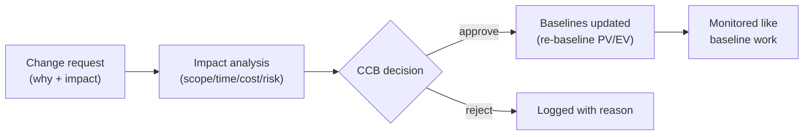

# L20 · Monitoring, Dashboards & Change Control

## Measure what matters, control change, keep baselines honest

Week 10 · Unit U4 · CLO4 · 2 hours

<!-- _class: lead -->

---

## Learning objectives

1. **Design** a sponsor dashboard from leading and lagging indicators
2. **Distinguish** leading from lagging signals — and name their failure modes
3. **Run** a change-control flow that protects the baseline without strangling work
4. **Explain** what a CCB decides, and what it must never decide

<!-- notes: This closes U4; the mock CCB (CS-27) is the unit's integrative exercise and rehearses midterm judgment questions. Timing ~5 min. -->

---

## Leading vs lagging: what each can and cannot say

| Type | Example | Can do | Cannot do |
|---|---|---|---|
| Lagging | CPI, SPI, defect counts | prove what happened | prevent it |
| Leading | open risks trend, review latency, WIP age | warn in time | lie convincingly |

- Dashboards die of **vanity metrics**: counts that always look fine
- Rule: every tile on a sponsor dashboard must have a **decision** it feeds

<!-- notes: The decision-feeds rule is the package's dashboard discipline — any tile without a consumer gets cut. Ask for a vanity metric from student experience ('lines of code' always lands). 4 min. -->

---

## Change control: the baseline's immune system

- Emergency changes: **decide fast, document immediately** — an undocumented emergency is indistinguishable from scope creep (CS-13 returns)
- CCB decides *changes to baselines*; it does not do the work, and it does not design

<!-- notes: The emergency-change discipline is the CS-13 linkage — the change log from L09 now has teeth. 5 min. -->

---

## CS / DS in the room

- **CS:** a sponsor dashboard with one tile per risk band + SPI/CPI trend + top-three issue ages — nothing else survives review
- **DS:** model-drift monitors are *leading* indicators — but only if someone subscribed to the alert; an unread alert is a vanity metric
- In DS projects, the data-quality rule status (L14) belongs on the sponsor dashboard

<!-- notes: The drift-alert point connects L14's rules to L20's monitoring — one system, not two. 3 min. -->

---

## Case anchor:

**CS-27** — *Sponsor dashboard and mock CCB*: design the five-tile dashboard, then run the change request against it in a mock CCB with role cards

<!-- notes: Role-play exercise — assign sponsor/PM/lead/QA cards from the key. The key grades decision quality and process adherence, not outcomes. Key: instructor/answer-keys/cases/CS-27.md. -->

---

## Discussion

1. Which is more dangerous: a CCB that approves everything, or one that approves nothing? For whom?
2. Your best leading indicator contradicts your lagging ones. Which do you report to the sponsor first?
3. What changes on an Agile project — and what still needs control? (Preview of U5.)

<!-- notes: Q2's expected answer: the leading one, with the lagging context — but say why in one sentence (decision timing). Q3 bridges to L21. 6 min. -->

---

## Summary & exit ticket

- Leading indicators warn; lagging indicators prove — dashboards need both, feeding decisions
- Change control protects the baseline; emergencies are documented *immediately*
- CCB governs baselines, never the work itself

**Exit ticket (2 min):** name one leading indicator for your capstone and the decision it feeds. If no decision, rename or drop it.

<!-- notes: Tickets feed the M2 monitoring artifact. U5 opens next lecture with Scrum. -->

---

## References & next lecture

- PMI (2021) *PMBOK® Guide* 7th ed. — measurement domain, change control
- Template: [`docs/templates/monitoring-dashboard-template.md`](../../docs/templates/index.md) · Lab 12: [`docs/labs/lab-12-communication.md`](../../docs/labs/index.md)
- Teaching package: `instructor/teaching-packages/U4-risk-uncertainty-control/L20-20-monitoring-control.md`
- **Next:** L21 — Scrum in Practice: roles, events, artifacts — and how they fail (Unit U5 opens)

<!-- notes: Preview U5 with the roles/events/artifacts map; Quiz 3 lands at L26 covering L21–L26. -->
