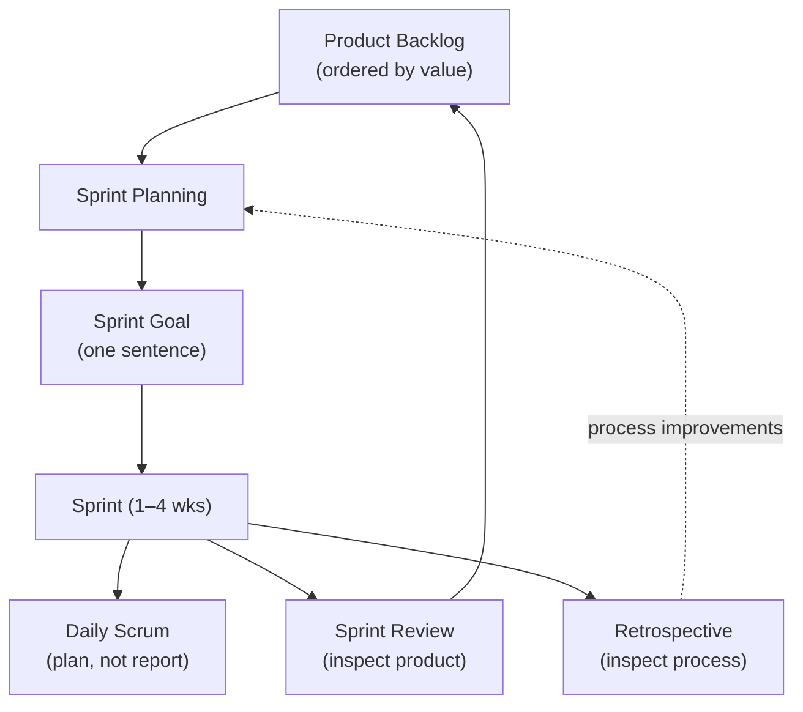

# L21 · Scrum in Practice

## Roles, events, artifacts — and how they fail in real teams

Week 11 · Unit U5 · CLO5 · 2 hours

<!-- _class: lead -->

---

## Learning objectives

1. **Map** Scrum's three roles, five events, three artifacts — and their failure modes
2. **Compute** sprint capacity from availability, focus factor, and ceremony load
3. **Commit** to a sprint goal with points that fit measured capacity
4. **Explain** why the Definition of Done is the team's quality contract

<!-- notes: The capacity slide runs the teaching package's verified chain (fits CS-28's 32-pt / 1.4 h-per-point data and CS-14's backlog). Quiz 3 covers L21–L26 — this arithmetic is fair game. Timing ~5 min. -->

---

## The Scrum machine

- Roles: **Product Owner** (what & order) · **ScrumMaster** (process, not PM) · **Developers** (how)
- The goal is written **before** items are picked — a backlog slice is not a goal

<!-- notes: The ScrumMaster-is-not-a-PM point calls back L04's roles discussion — different accountability structure, not a renamed PM. The goal-before-items rule is CS-28's first checkpoint. 5 min. -->

---

## Sprint capacity, fully worked (verified chain)

| Step | Computation | Result |
|---|---|---|
| Available hours | 4 devs × 2 wk × 10 h/wk | 80 h |
| Absence (exam week) | −6 h | 74 h |
| Focus factor 0.7 | 74 × 0.7 | ≈ 52 h |
| Ceremonies (planning 2 + review 1 + retro 1 + dailies 1.25) | −5.25 h | |
| **Build capacity** | | **≈ 46–47 h** |
| Backlog items (CS-14's points) | 5+8+3+5+8+3 = 32 pts | |
| Conversion (team's own rate) | ~1.4 h/pt | 32 × 1.4 ≈ **45 h ✓ fits** |

- The h/pt rate is **the team's measured history** — industry folklore (8–12 h/pt) defeats the point of points

<!-- notes: Every figure is the teaching package's chain, consistent with CS-28's checker-verified capacity (≈18.6 pts at the same focus factor — different backlog, same machine). 7 min, board. -->

---

## DoD: the team's quality contract

- Definition of Done: code reviewed · tests pass · docs updated · demo-able — **per item, checkable by anyone**
- Done ≠ "it works on my machine"; a spike's DoD includes its **exit criterion** ("auth latency measured on 1k sessions — go/no-go")
- CS-29's workshop: teams negotiate their own DoD — then live by it for the sprint

<!-- notes: The spike-exit-criterion point is CS-14's 8-pointer carried forward — spikes are bought knowledge with a stated question. 3 min. -->

---

## CS / DS in the room

- **CS:** a capstone team running two-week sprints — CS-28 is exactly this planning session
- **DS:** a modelling sprint where the DoD must include **evaluation evidence** (baseline beaten, on held-out data) — not 'model improved'
- Velocity is a *planning* signal, never a performance score — the moment it's a KPI, teams inflate points

<!-- notes: The velocity-goodhart warning is the package's key misconception and a Quiz 3 candidate. 3 min. -->

---

## Case anchor:

**CS-28** — *Sprint planning for the capstone*: run the capacity chain, commit points that fit, write the goal first
**CS-29** — *Definition-of-Done workshop*: negotiate a DoD your team can actually hold for a sprint

<!-- notes: CS-28 numeric (verified: commit 18 pts on the case's 260 effective hours), CS-29 workshop. Keys: instructor/answer-keys/cases/CS-28.md, CS-29.md. Lab 14 (agile sprint) is the CAMPUS-MEND version. -->

---

## Discussion

1. Your PO wants 24 points committed; capacity says 18. What exactly happens next — and who decides?
2. Can a Scrum team have a PM? What would that person do all day?
3. Why does velocity fail as a cross-team comparison metric?

<!-- notes: Q1 is a negotiation rehearsal (L26's skills land next-next lecture); expected: scope options, not capacity fudging. Q3: different rulers — points are team-local. 6 min. -->

---

## Summary & exit ticket

- Goal before items; capacity before commitment; DoD before 'done'
- Capacity = availability × focus − ceremonies; convert with **your own** h/pt rate
- Roles split what/how/order — the ScrumMaster is not a PM

**Exit ticket (2 min):** compute your capstone team's sprint capacity with the chain (real hours, focus 0.7), and the point commitment you'd defend.

<!-- notes: Tickets feed Lab 14 and the M3 capstone iteration. Preview L22: Kanban — same goal, different machinery (no sprints). -->

---

## References & next lecture

- Schwaber & Sutherland (2020) *The Scrum Guide* (scrumguides.org)
- Teaching package: `instructor/teaching-packages/U5-adaptive-delivery-teams/L21-21-scrum.md`
- Template: [`docs/templates/sprint-planning-template.md`](../../docs/templates/index.md) · Lab 14: [`docs/labs/lab-14-agile-sprint.md`](../../docs/labs/index.md)
- **Next:** L22 — Kanban, Flow & Throughput: visualize, limit WIP, measure flow

<!-- notes: The Scrum Guide is freely available and syllabus-listed. Preview L22 with the WIP-limit arithmetic CS-30 carries. -->
