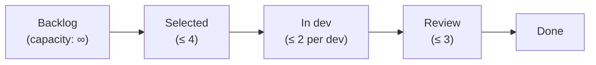
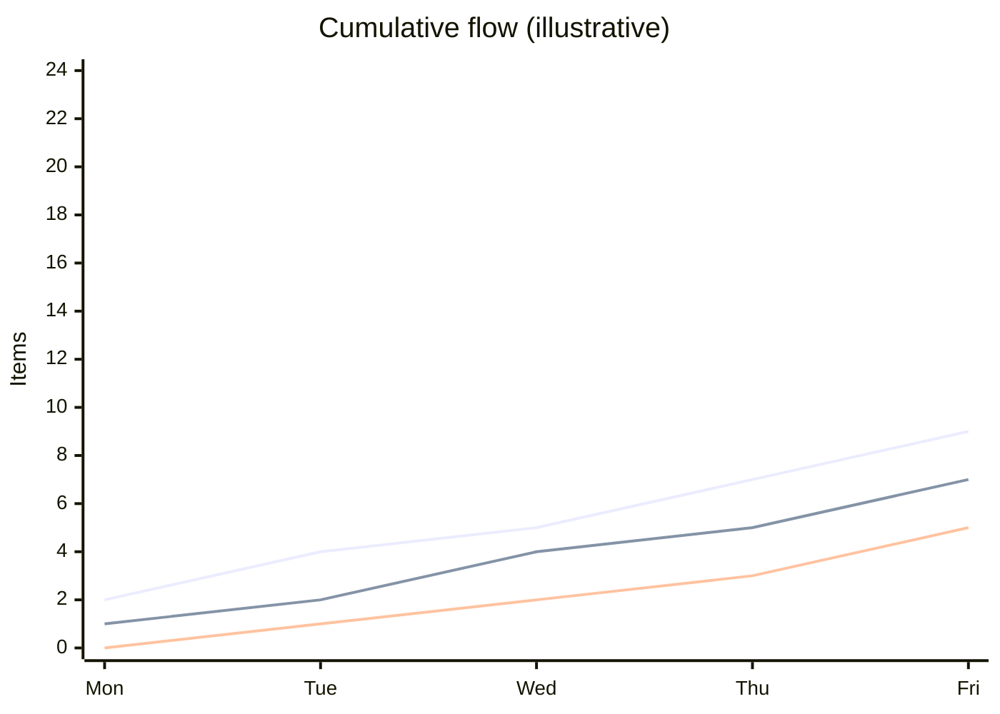

# L22 · Kanban, Flow & Throughput

## Visualize work, limit WIP, measure flow — the data scientist's favorite agile method

Week 11 · Unit U5 · CLO5 · 2 hours

<!-- _class: lead -->

---

## Learning objectives

1. **Apply** Kanban's three practices: visualize, limit WIP, manage flow
2. **Compute** with Little's Law: WIP = throughput × cycle time
3. **Read** a CFD (cumulative flow diagram) for bottlenecks
4. **Choose** between Scrum and Kanban for a given work shape

<!-- notes: Little's Law arithmetic uses CS-30's checker-verified values. The Scrum-vs-Kanban choice is a Quiz 3 judgment item. Timing ~5 min. -->

---

## The Kanban board and its rules

- **WIP limits are the method** — a board without limits is a to-do list wearing stickers
- Limits expose the bottleneck: the column that is always full *is* your constraint

<!-- notes: The 'always-full column' heuristic is the package's bottleneck finder. Ask what it means when Review is always full (review capacity, not dev speed — usually). 4 min. -->

---

## Little's Law, worked (CS-30, verified)

**L = λ × W** — WIP = throughput × cycle time

| Step | Computation | Result |
|---|---|---|
| Current: WIP 12, throughput 4/wk | 12 = 4 × CT | **CT = 3.0 wk** |
| Target cycle time 1.33 wk | WIP = 9 × 1.33 | **WIP = 12** at throughput 9/wk |
| Throughput needed for target | λ = WIP / CT | **9.0 /wk** at WIP 12 |

- The uses differ: cut **WIP** to cut cycle time at fixed throughput; raise **throughput** by removing the bottleneck — never by shouting

<!-- notes: All three numbers are CS-30's verified chain (CT 3.0, WIP 12, throughput 9.0). The last line is the management lesson: WIP limits create slack that becomes speed. 6 min, board. -->

---

## Reading the CFD

- **Vertical gap** = WIP at that moment · **horizontal gap** = average cycle time
- A widening band = a growing queue = tomorrow's bottleneck announcing itself

<!-- notes: The chart is illustrative (not case data) — say so. Two readings, one chart; students photograph this slide. 4 min. -->

---

## CS / DS in the room

- **CS:** a support/ops stream with unplannable arrivals — Kanban's pull fits where sprints would just queue
- **DS:** an experimentation pipeline: analysis requests arrive continuously; WIP limits stop five half-done notebooks
- The half-done-notebook pile is DS's WIP debt — invisible, compounding, and honest to measure

<!-- notes: The notebook-WIP image lands hard with this cohort — connect to L14's reproducibility rules. 3 min. -->

---

## Case anchor:

**CS-30** — *WIP limits as throttles*: compute the cycle time, set the WIP for a 1.33-week target, and defend where the limit will hurt first

<!-- notes: Numeric case, checker-verified (CT 3.0 → WIP 12 at throughput 9.0). Key: instructor/answer-keys/cases/CS-30.md. The 'where it hurts' defense is the graded judgment. -->

---

## Discussion

1. Why do WIP limits *feel* like less work is getting done — and what does that feeling measure?
2. When is a sprint the wrong container? Give a work shape, not a preference.
3. Your CFD shows a widening Review band. Name two interventions with different trade-offs.

<!-- notes: Q1's expected answer: it measures queue departure, not value delivery — sublinear WIP-to-value is the point. Q3: add reviewer capacity vs shrink batch size — different costs, same column. 6 min. -->

---

## Summary & exit ticket

- Visualize → limit WIP → manage flow; limits expose constraints
- Little's Law: WIP = throughput × cycle time — pick which variable you control
- CFD: vertical = WIP, horizontal = cycle time, widening = warning

**Exit ticket (2 min):** your team's throughput is 6 items/wk and WIP is 18. Compute cycle time, then the WIP that halves it.

<!-- notes: Answer: CT = 3 wk; halving CT at fixed throughput → WIP 9. Formative; CS-30's method. -->

---

## References & next lecture

- Anderson (2010) *Kanban: Successful Evolutionary Change for Your Technology Business*
- Teaching package: `instructor/teaching-packages/U5-adaptive-delivery-teams/L22-22-kanban-flow.md`
- **Next:** L23 — Agile for Data Science & ML Projects: sprints that respect experiments

<!-- notes: Preview L23 with the experiment-vs-feature distinction — the backlog rewrite case (CS-31) and model DoD (CS-32). -->
