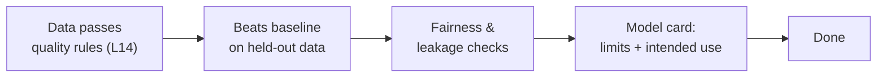

# L23 · Agile for Data Science & ML Projects

## Sprints that respect experiments, data discovery, and model work

Week 12 · Unit U5 · CLO5 · 2 hours

<!-- _class: lead -->

---

## Learning objectives

1. **Rewrite** feature-first backlog items as hypothesis-first experiments
2. **Define** a model Definition of Done with evaluation evidence
3. **Insert** a model-risk gate into an adaptive life cycle (L05's hybrid, grown up)
4. **Plan** DS sprints with an explicit discovery allowance

<!-- notes: This is the cohort's signature lecture — everything else transfers, this one transforms. CS-31/CS-32 are both workshop cases. Timing ~5 min. -->

---

## Feature-first vs hypothesis-first

| Feature-first (fails) | Hypothesis-first (works) |
|---|---|
| "Build churn-score API" | "Test: 30-day inactivity predicts churn with AUC ≥ 0.75" |
| Done = code merged | Done = hypothesis **supported or refuted, with evidence** |
| Failure = wasted sprint | Refutation = **bought knowledge**, budgeted like any deliverable |

- A refuted hypothesis that kills a doomed feature *saved* the project — celebrate it in review, not retro

<!-- notes: The refutation-as-value reframe is the lecture's core attitude shift. Rewrite one student backlog item live. 5 min. -->

---

## The model Definition of Done

- "Model improved" is not Done — **evidence** is Done: baseline comparison, held-out evaluation, failure analysis
- The model card's 'limits' section is where responsible AI becomes a *deliverable* (L27 preview)

<!-- notes: The five-stage DoD is the package's checklist. The leakage check is where student models most often die — say why (temporal leakage in time-series features). 5 min. -->

---

## The model-risk gate

- L05's handover contract, grown up: between modelling sprints, a **gate** checks
  - data drift since last gate · fairness metrics vs threshold · explainability evidence for decisions
- Fail → iterate inside the sprint; pass → deploy path opens
- This is PMBOK's uncertainty domain meeting the adaptive approach — **by design, not apology**

<!-- notes: The gate structure is CS-32's architecture. Tie to L05's gate-evidence discipline: same mechanism, new evidence types. 4 min. -->

---

## CS / DS in the room

- **CS:** a backend team adopts experiment framing for performance work: "hypothesis: caching cuts p95 to < 200 ms" — same discipline
- **DS:** CS-31 rewrites a feature backlog into a hypothesis board; CS-32 drafts the model DoD with named fairness metrics
- Discovery allowance: budget 20–30% of sprint capacity for unbooked exploration — pretend otherwise and discovery happens anyway, unmanaged

<!-- notes: The discovery-allowance number is the package's planning guidance — the honest alternative to pretend-certainty. 3 min. -->

---

## Case anchor:

**CS-31** — *Feature-first to hypothesis-first backlog rewrite*: convert eight items; argue which refutations would change the project
**CS-32** — *Model definition-of-done*: draft the five-stage DoD with thresholds your team could hold

<!-- notes: Workshop cases — keys grade the evidence discipline, not the specific hypotheses. Keys: instructor/answer-keys/cases/CS-31.md, CS-32.md. Both feed the capstone M3 iteration plan. -->

---

## Discussion

1. What does a burndown chart even mean on a discovery-heavy sprint — and what would you chart instead?
2. Who owns the model-risk gate decision: PO, team, or a governance board? What changes with each answer?
3. Is a refuted hypothesis 'wasted effort' under your university's grading rules? Should it be?

<!-- notes: Q2's answer trade: PO-owned gates are fast but soft; board-owned gates are slow but defensible — the capstone will force this choice. 6 min. -->

---

## Summary & exit ticket

- Hypothesis-first items make refutation valuable and evidence central
- Model DoD = quality rules + baseline + fairness + model card
- Model-risk gates give adaptive projects their governance spine

**Exit ticket (2 min):** rewrite one of your capstone's backlog items as a testable hypothesis with a numeric success threshold.

<!-- notes: Tickets feed M3. Preview L24: when one team isn't enough — scaling without ceremony sprawl. -->

---

## References & next lecture

- Amershi et al. (2019) *Software Engineering for Machine Learning: A Case Study* — ICSE-SEIP (industry practice for ML pipelines; syllabus-listed)
- Mitchell et al. (2019) *Model Cards for Model Reporting*, FAT\* (public, syllabus-consistent)
- Teaching package: `instructor/teaching-packages/U5-adaptive-delivery-teams/L23-23-agile-data-ml.md`
- **Next:** L24 — Scaling Frameworks & Hybrid Delivery

<!-- notes: Both citations are real, public, and syllabus-consistent (verified against the L23 package's reading list). Preview L24 with the 40-person program case. -->
