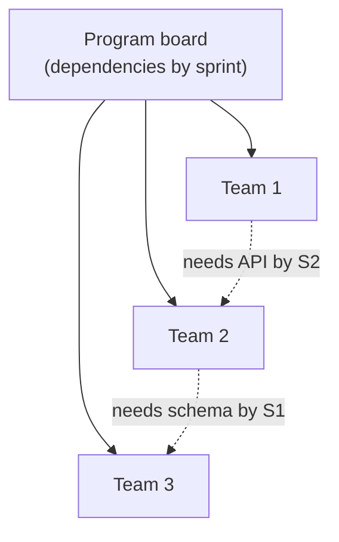

# L24 · Scaling Frameworks & Hybrid Delivery

## SAFe at a distance, Scrum-of-Scrums, and pragmatic hybrids

Week 12 · Unit U5 · CLO5 · 2 hours

<!-- _class: lead -->

---

## Learning objectives

1. **Explain** why scaling agile is a coordination problem, not a process-copying problem
2. **Run** a Scrum-of-Scrums: what is reported, what is escalated, what is banned
3. **Map** a 40-person program onto teams with explicit dependency management
4. **Design** a pragmatic hybrid without ceremony sprawl

<!-- notes: The stance of this lecture (and the package) is critical pragmatism: frameworks are coordination tools, not ideologies. CS-33 is the mapping exercise. Timing ~5 min. -->

---

## What scale changes

- One team: coordination is a hallway conversation
- Ten teams: coordination is **architecture, cadence, and dependency boards**
- SAFe's answer: layers, ARTs, PI planning — heavy, sometimes right, often rented
- Scrum-of-Scrums answer: representatives sync **blockers and dependencies** — not status theatre

<!-- notes: The dependency board is the scaling artifact that actually pays rent. The SoS rules slide follows — what is banned matters more than what is required. 5 min. -->

---

## Scrum-of-Scrums: the working rules

| Report (per rep, 5 min) | Banned content |
|---|---|
| My team delivered for you: … | Individual task status |
| My team needs from you: … | Reason-free escalations |
| Blockers needing a decision: … | Broadcasts nobody consumes |

- Escalation path: rep → ScrumMasters → program layer — **with the dependency, not the blame**
- If an SoS produces no decisions for two weeks, shrink it or kill it

<!-- notes: The two-week no-decision kill rule is the package's pragmatism test. CS-33's mapping exercise enforces these rules. 4 min. -->

---

## CS / DS in the room

- **CS:** a 40-person campus-system program — five teams, one shared schema, one shared auth service: CS-33's exact shape
- **DS:** a bank's analytics platform program: modelling teams share the feature store — the dependency isn't code, it's **data contracts**
- Hybrid delivery: predictive spine for the platform release train, adaptive flesh per team (L05's pattern at scale)

<!-- notes: The data-contract dependency is the DS-specific scaling insight — it previews L27's data governance. 3 min. -->

---

## Case anchor:

**CS-33** — *Mapping a 40-person program onto Scrum-of-Scrums*: draw the teams, the dependency board, and the SoS rules you would enforce

<!-- notes: Design case, no single answer — the key grades dependency completeness and the banned-content rules. Key: instructor/answer-keys/cases/CS-33.md. -->

---

## Discussion

1. SAFe costs weeks of ceremony per quarter. What evidence would justify it — and what would tell you to stay small?
2. Can dependencies be *designed away*? Give one architectural move that deletes a coordination cost.
3. Your SoS rep reports status but never blockers. Fix the meeting or the rep?

<!-- notes: Q2 is the architect's answer to scaling (shared platforms delete dependencies rather than manage them) — worth 2 extra minutes. 6 min. -->

---

## Summary & exit ticket

- Scaling = coordination management: cadence, dependency boards, escalation paths
- SoS reports dependencies and blockers — everything else is theatre
- Hybrids scale the L05 pattern: predictive spine, adaptive per-team flesh

**Exit ticket (2 min):** your capstone has 2 teams (rare but real). Write the one dependency rule their SoS would enforce.

<!-- notes: Tickets feed M3's coordination section. Preview L25: the team itself — performance, safety, conflict. -->

---

## References & next lecture

- PMI (2021) *PMBOK® Guide* 7th ed. — team & planning domains at program scale
- Teaching package: `instructor/teaching-packages/U5-adaptive-delivery-teams/L24-24-scaling-hybrid.md`
- **Next:** L25 — Team Performance & Leadership: from Tuckman to psychological safety

<!-- notes: Preview L25 with the working-agreement and conflict-mode cases (CS-34/CS-35, role cards). -->
