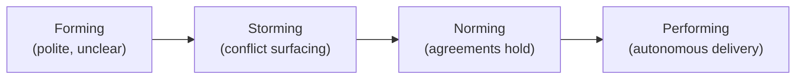

# L25 · Team Performance & Leadership

## From Tuckman to psychological safety to motivation that works

Week 13 · Unit U5 · CLO5 · 2 hours

<!-- _class: lead -->

---

## Learning objectives

1. **Locate** a team's Tuckman stage and choose the leadership mode it needs
2. **Explain** psychological safety as a performance system, not a comfort program
3. **Diagnose** a conflict and select a resolution mode deliberately
4. **Draft** a team working agreement the team will actually enforce

<!-- notes: Non-calculation lecture — the instruments are role cards (CS-35) and the working agreement (CS-34). Quiz 3 at L26 covers this conceptually (no arithmetic). Timing ~5 min. -->

---

## Tuckman's stages and the leadership each demands

- Forming needs **direction** · Storming needs **coaching** · Norming needs **support** · Performing needs **delegation**
- Storming is not failure — skipping it (fake harmony) is

<!-- notes: The stage-to-leadership mapping is the package's situational-leadership core. Ask students to place their worst group project (storming, unnavigated). 4 min. -->

---

## Psychological safety: the operating system

- Definition (Edmondson): belief that **interpersonal risk-taking** — questions, admits, dissent — will not be punished
- The mechanism: errors surface **early** → cheap fixes; silence → late discovery → expensive fixes
- Safety ≠ comfort: high standards + high safety = learning zone; low both = the comfort zone that ships nothing

<!-- notes: Edmondson is the citation of record (The Fearless Organization, 2018 — syllabus-consistent). The 2×2 (standards × safety) is worth drawing live. 4 min. -->

---

## Conflict: five modes, one deliberate choice

| Mode | When it's right | When it fails |
|---|---|---|
| Collaborate | real stakes, time exists | trivial issues (overkill) |
| Compromise | equal power, deadline | values conflicts |
| Accommodate | you're wrong; relationship > issue | chronic self-erasure |
| Avoid | cooling-off; trivial | important issues (default mode!) |
| Compete | emergency; ethics line | everyday work (burns trust) |

- **CS-35's exercise:** role cards force each mode's voice — you'll feel your default mode before you can choose it

<!-- notes: The TKI five-mode table is the assessment framework (Quiz 3 + final's judgment section). 'Avoid as default' is the package's named trap. 5 min. -->

---

## CS / DS in the room

- **CS:** a code-review war: style vs substance — storming symptom; the working agreement names review etiquette before it recurs
- **DS:** the analyst-vs-engineer conflict (exploration vs pipelines) — classic norms gap; CS-34's agreement gives it a channel
- Motivation reality: autonomy and mastery move engineers; donuts do not

<!-- notes: Both conflicts come from the package's examples. The motivation line sets up the exit ticket's self-diagnosis. 3 min. -->

---

## Case anchor:

**CS-34** — *Team working agreement*: draft the eight-clause agreement (meetings, reviews, disagreement, help) your team signs
**CS-35** — *Conflict-mode case with role cards*: the sponsor-vs-lead deadlock; each card must argue its mode — then the room votes on the right one

<!-- notes: Role-play: 6 cards, 15 minutes, debrief on default modes. Keys: instructor/answer-keys/cases/CS-34.md, CS-35.md (facilitation script + mode analysis). Non-numeric by design. -->

---

## Discussion

1. Can psychological safety exist where the *grader* punishes error? What would you change about course design?
2. Which conflict mode is your default under deadline pressure — and what would deliberate choice look like?
3. Your best engineer is a chronic competitor mode. Fix the person, the system, or the fit?

<!-- notes: Q1 is the honest course-design conversation — surface it now, before peer review at M3. Q3's expected: system/fit before person. 6 min. -->

---

## Summary & exit ticket

- Stage-appropriate leadership: direct, coach, support, delegate
- Psychological safety converts silent errors into early, cheap ones
- Conflict modes are tools — your default is not always your choice

**Exit ticket (2 min, anonymous):** name your default conflict mode and one situation this month where the deliberate choice would differ.

<!-- notes: Anonymous collection matters — the honesty of these tickets predicts the M3 peer-review climate. Preview L26: communication and negotiation — Quiz 3 opens there. -->

---

## References & next lecture

- Tuckman (1965) *Developmental Sequence in Small Groups* — Psychological Bulletin
- Edmondson (2018) *The Fearless Organization* — Wiley
- Teaching package: `instructor/teaching-packages/U5-adaptive-delivery-teams/L25-25-team-performance.md`
- **Next:** L26 — Communication & Negotiation (**Quiz 3 opens at the start of class, L21–L26**)

<!-- notes: Citations verified against the L25 package's reading list. Quiz 3: instructor/exam-bank/quiz3.md. -->
