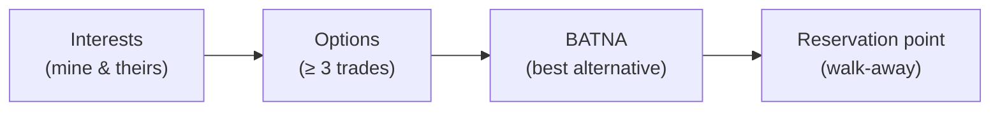

# L26 · Stakeholder Communication & Negotiation

## Getting the right message to the right stakeholder — and closing the deal

Week 13 · Unit U5 · CLO5 · 2 hours

<!-- _class: lead -->

---

## Learning objectives

1. **Design** a communication plan from stakeholder needs, not from habit
2. **Prepare** a negotiation with BATNA, reservation point, and trades
3. **Deliver** bad news early with options, ownership, and a recovery ask
4. **Choose** the right channel for the message's stakes and audience

<!-- notes: Quiz 3 (L21–L26, 15 min) runs FIRST — instructor/exam-bank/quiz3.md. Both cases are role-plays; the negotiation case (CS-36) uses BATNA prep from the key. Timing ~5 min. -->

---

## The communication plan is a design artifact

| Stakeholder | What they need | Channel | Cadence | Owner |
|---|---|---|---|---|
| Sponsor | variance + decisions needed | 1-page brief | biweekly | PM |
| Data owner | access impact, consent scope | working session | per change | analyst |
| Team | context for their decisions | standup + board | daily | leads |
| End users | what changes for them | release note | per release | PO |

- Rule: every row answers "*what decision does this reader make with it?*"
- Channel follows **stakes**: bad news by meeting, routine by dashboard — never the reverse

<!-- notes: The decision-per-row rule is the package's comms discipline. The channel-stakes rule sets up CS-37. Lab 12 builds this plan. 5 min. -->

---

## Negotiation: prepare the floor before the room

- BATNA is power: the side that can walk, negotiates
- Trade *variables*, not concessions: scope ↔ schedule ↔ payment ↔ risk buffer
- CS-36's scope cut: your BATNA is the re-baselined plan — arrive with it **costed**

<!-- notes: The four-box prep chain is the package's negotiation skeleton. The costed-BATNA point converts negotiation from bluffing to engineering. 5 min. -->

---

## Delivering bad news early

1. **The fact** — one sentence, no adjectives: "CPI is 0.87; EAC breaches funding by 9,600"
2. **The cause** — verified, not speculated
3. **Options** — two to three, each costed (crash, de-scope, re-baseline)
4. **The ask** — the decision you need, by when
5. **Ownership** — what *you* will do regardless of their choice

- Late bad news is expensive bad news; early bad news is a **project-management deliverable**

<!-- notes: The five-part script is the package's instrument and CS-37's rubric. Connect back to L19: the numbers exist precisely to make this conversation possible. 5 min. -->

---

## CS / DS in the room

- **CS:** negotiating test-phase compression with a sponsor who wants the date — trades surface fast when the BATNA is costed
- **DS:** telling a stakeholder the model *can't* meet the accuracy promise — the same five-part script, plus the model card's limits (L23)
- 'No' with options is a professional deliverable; 'yes' without analysis is a liability

<!-- notes: The DS accuracy-promise conversation is this cohort's most likely real-world rehearsal. 3 min. -->

---

## Case anchor:

**CS-36** — *Negotiating a scope cut with the sponsor*: role-played with prep sheet; graded on trades created, not ground conceded
**CS-37** — *Delivering bad news early*: the memo + the meeting; each part of the five-part script is scored

<!-- notes: Two role-plays, 20 min total; observers score with the key's rubric. Keys: instructor/answer-keys/cases/CS-36.md, CS-37.md. Non-numeric by design. -->

---

## Discussion

1. When is email the *wrong* channel for good news — and why does that asymmetry exist?
2. Your BATNA is weak (you cannot walk). What legitimate alternatives to power do you have in the room?
3. Which stakeholder in your capstone gets the *most* communication — and is that the one who *needs* it?

<!-- notes: Q2's expected directions: objective criteria, coalition, reframing interests — soft power done honestly. 6 min. -->

---

## Summary & exit ticket

- Communication plans serve reader decisions, not sender convenience
- Negotiation: interests → options → BATNA → reservation point — arrive costed
- Bad news early = facts, cause, options, ask, ownership

**Exit ticket (2 min):** write your capstone's one-line "bad news" for a 1-week slip, then the two costed options you'd bring with it.

<!-- notes: Tickets rehearse the script format graded in CS-37. Preview L27: the master plan — everything integrated. -->

---

## References & next lecture

- Fisher & Ury (1981) *Getting to Yes* — Penguin (principled negotiation; syllabus-listed)
- PMI (2021) *PMBOK® Guide* 7th ed. — stakeholder & project work domains
- Teaching package: `instructor/teaching-packages/U6-integration-ethics-closing/L26-26-communication-negotiation.md`
- **Next:** L27 — The Master Project Plan: integrating everything

<!-- notes: Fisher & Ury verified against the L26 package's reading list. Preview L27 with the integration map — the capstone's skeleton. -->
