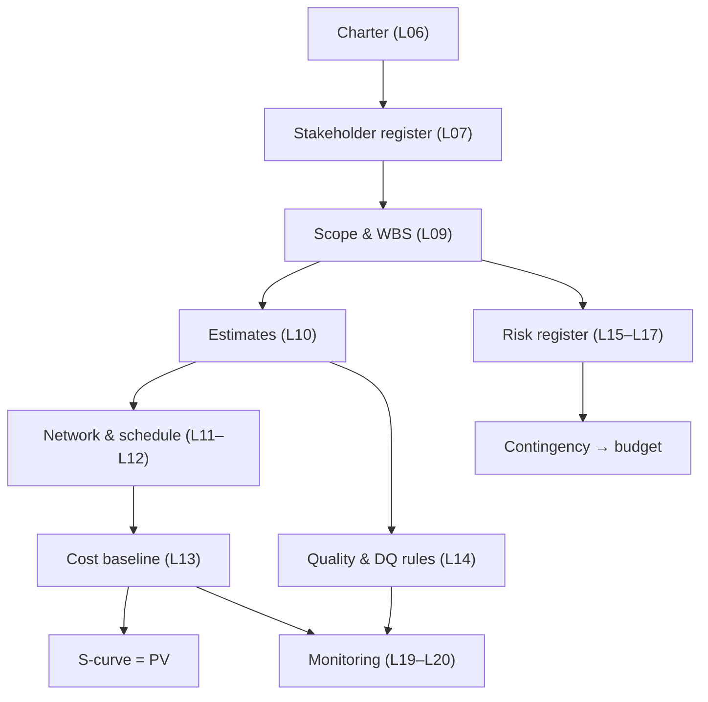

# L27 · The Master Project Plan: Integrating Everything

## One plan, every artifact, zero contradictions

Week 14 · Unit U6 · CLO6 · 2 hours

<!-- _class: lead -->

---

## Learning objectives

1. **Assemble** the master plan from the term's artifacts in dependency order
2. **Run** consistency checks across artifacts (the red-team's first pass)
3. **Integrate** data-governance and responsible-AI requirements into the plan's spine
4. **Defend** an integrated plan against a structured red-team

<!-- notes: This is the capstone's assembly lecture — M4 (plan due L27, defended L32) is built here. The red-team checklist mirrors instructor/rubrics/capstone-plan.md. Timing ~5 min. -->

---

## The integration map

- Every arrow is a **consistency claim**: estimates feed network feeds budget feeds PV
- The plan is integrated when changing one artifact *forces* the updates downstream

<!-- notes: Walk the two chains: scope→money and risk→money. The contingency arrow is where student plans break most. 5 min. -->

---

## The red-team's first six checks

1. **100% rule** — WBS children sum; nothing outside the WBS
2. **Estimate chain** — package hours → labor → budget, no orphan numbers
3. **Schedule↔budget** — S-curve dates match network dates
4. **Risk↔contingency** — top EMV risks have responses funded by contingency
5. **Success criteria** — every charter objective has a verifiable criterion (L06)
6. **Governance** — data rules (L14) and gates (L23) have owners and dates

<!-- notes: These six are the peer-review instrument (docs/capstone/peer-review.md) — students red-team each other's plans today. 5 min. -->

---

## Data governance in the plan's spine

- **Consent & lawful basis** — stated in the charter's success criteria where personal data is involved
- **Data-quality rules** — owned (L07's owners), scheduled (in the WBS), monitored (L20)
- **Model-risk gate** — dated in the schedule, evidence defined (L23)
- Responsible AI is not a policy appendix: it is **WBS rows, budget lines, and gate evidence**

<!-- notes: This slide is the CLO6 core: governance as artifacts, not aspirations. The DS capstone track requires the model-risk gate explicitly (docs/capstone/specification.md). 4 min. -->

---

## CS / DS in the room

- **CS:** the campus-portal plan — auth service slip forces the network, then the budget, then the benefits case to move **together**
- **DS:** the AGROSENSE-style yield-model plan — consent scope changes ripple through WBS, gates, and fairness evidence
- Integration is the plan's *property*, not its *format* — a pretty deck with orphan numbers is not a plan

<!-- notes: The orphan-numbers line is the lecture's thesis and the red-team's criterion of success. 3 min. -->

---

## Case anchor:

**CS-38** — *Master-plan assembly and red-team review*: assemble the skeleton, then attack a peer plan with the six checks

<!-- notes: The red-team is a graded role (defense of the six checks, not vandalism). Key: instructor/answer-keys/cases/CS-38.md. Capstone M4 plan due at L27 per milestones — the lab block today IS assembly time. -->

---

## Discussion

1. Which consistency break is *hardest* to see in your own plan — and who is best placed to see it?
2. Your governance gate will slip the release by two weeks. Argue the trade both ways — which argument wins in your sector?
3. What belongs in the master plan that no single lecture produced?

<!-- notes: Q3's expected direction: the integration narrative itself — assumptions register, decision log, tailoring rationale. 6 min. -->

---

## Summary & exit ticket

- The master plan is a **claim of consistency** across every artifact
- Six red-team checks catch the breaks that reviewers actually find
- Governance lives in WBS rows, budget lines, and gate evidence — not appendices

**Exit ticket (2 min):** run check #2 (estimate chain) on your capstone draft — name the first orphan number you found, or write 'clean' if truly none.

<!-- notes: The 'clean' option is honest if true; the tickets predict M4's most common defect. Preview L28: ethics — where the professional stakes live. -->

---

## References & next lecture

- PMI (2021) *PMBOK® Guide* 7th ed. — integration on the planning & delivery domains
- Rubric: `instructor/rubrics/capstone-plan.md` · Peer review: [`docs/capstone/peer-review.md`](../../docs/capstone/index.md)
- Teaching package: `instructor/teaching-packages/U6-integration-ethics-closing/L27-27-master-plan.md`
- **Next:** L28 — Ethics, Governance & Professional Responsibility

<!-- notes: Preview L28 with the four dilemmas case (CS-39) — written positions, not vibes. -->
