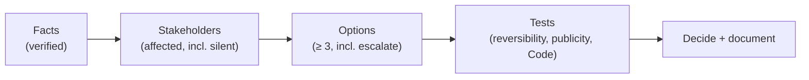

# L28 · Ethics, Governance & Professional Responsibility

## The decisions that outlive the project

Week 14 · Unit U6 · CLO6 · 2 hours

<!-- _class: lead -->

---

## Learning objectives

1. **Apply** the PMI Code's four values to concrete project dilemmas
2. **Use** a defensible decision framework (facts → stakeholders → options → test → decide)
3. **Design** governance structures that make ethical action easier, not harder
4. **Write** a reasoned position on a responsible-AI dilemma

<!-- notes: CLO6's home lecture. CS-39 is a written-positions instrument — grading is on reasoning quality, not conclusions. Timing ~5 min. -->

---

## The four values, under load

| PMI Code value | Tested when… |
|---|---|
| **Responsibility** | the slip is yours but the story could be someone else's |
| **Respect** | the stakeholder is powerless and annoying |
| **Fairness** | the vendor offers you 'advisory' hospitality |
| **Honesty** | the status is green if you exclude the thing you know |

- Ethics failures are usually **gradual**: small exclusions, normalized
- Governance exists because good people under pressure need structure

<!-- notes: The 'green if you exclude it' row is the honesty trap the final exam's judgment section echoes. The gradualism point is the package's framing. 4 min. -->

---

## A decision framework that survives review

- **Publicity test:** could you defend this choice on the record? If not, why are you making it?
- **Reversibility test:** if wrong, what does undoing it cost — and who pays?

<!-- notes: The two tests are the package's quick instruments. 'Escalate' as a legitimate option legitimizes raising hard calls — L04's ethics seed resolves here. 5 min. -->

---

## Governance that makes ethics cheaper

- **Decision log** — who decided, when, with what evidence (CS-13's change log, grown up)
- **Escalation paths** — named, rehearsed, blame-free
- **Data governance board** — consent, retention, model-risk gates (L27's spine, formalized)
- Whistleblowing channels that **actually function** — tested, not poster-grade

<!-- notes: The governance-as-friction-reducer framing is the lecture's constructive turn: rules exist so individuals don't carry institutional weight alone. 4 min. -->

---

## CS / DS in the room

- **CS:** the 'temporary' analytics backdoor that survived three handovers — governance holes outlive intent
- **DS:** a bias discovered post-launch: disclose, patch, or quiet-retrain? Each option has stakeholders without a seat
- Responsible AI: fairness thresholds (L23's gate), explainability for affected users, honest model cards — **all already in your plan**

<!-- notes: The last line ties CLO6 to artifacts students already built — ethics as project work, not sermon. 3 min. -->

---

## Case anchor:

**CS-39** — *Four ethics dilemmas in writing*: positions of ≤ 120 words each, using the framework; the third dilemma is a responsible-AI consent case

<!-- notes: Written instrument — the key's rubric scores framework use, stakeholder completeness, and the tests applied. Key: instructor/answer-keys/cases/CS-39.md. 25 minutes in class. -->

---

## Discussion

1. Is it ethical to A/B test a feature on users who cannot opt out? Where exactly does the line cross?
2. Your sponsor asks you to exclude a known risk from the register 'to keep the board confident'. Draft your one-sentence reply.
3. Which governance artifact from this course would have prevented your worst group-project experience?

<!-- notes: Q2 is the rehearsal that matters — the sentence exists (register integrity, sponsor's own interest, EAC honesty). 6 min. -->

---

## Summary & exit ticket

- Four values under load; failures are gradual and structural
- Framework: facts → stakeholders → options → tests → decide **and document**
- Governance makes ethical action cheaper — build it into the plan

**Exit ticket (2 min):** name one decision in your capstone that needs the publicity test before M4 — and the test's outcome so far.

<!-- notes: Tickets feed M4's governance section. Preview L29: sustainability and benefits — the 'after the project' lecture. -->

---

## References & next lecture

- PMI *Code of Ethics and Professional Conduct* (responsibility · respect · fairness · honesty)
- PMI (2021) *PMBOK® Guide* 7th ed. — stewardship principle
- Teaching package: `instructor/teaching-packages/U6-integration-ethics-closing/L28-28-ethics-governance.md`
- **Next:** L29 — Sustainability & Benefits Realization

<!-- notes: Preview L29 with the compute-footprint case (CS-40, numeric) and the benefits map. -->
