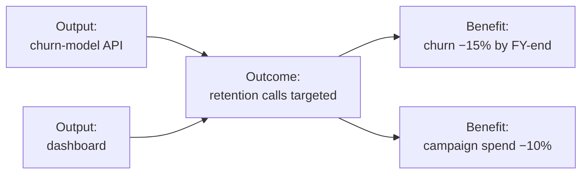

# L29 · Sustainability & Benefits Realization

## The project ends; the value question does not

Week 15 · Unit U6 · CLO6 · 2 hours

<!-- _class: lead -->

---

## Learning objectives

1. **Build** a benefits map linking outputs → outcomes → strategic benefit
2. **Compute** the compute footprint of a modelling strategy (energy, CO₂, cost)
3. **Trade** accuracy against sustainability honestly — with numbers
4. **Plan** the handover that keeps value flowing after the team dissolves

<!-- notes: CLO6 continues: value beyond delivery. The compute slide runs CS-40's checker-verified chain. Timing ~5 min. -->

---

## The benefits map

- Outputs are what you build; **outcomes** are behavior change; benefits are measured strategic value
- Every benefit needs: metric, baseline, owner, and a **measurement date after the project ends**

<!-- notes: The output/outcome distinction is the package's core teaching — students routinely call outputs benefits. The post-project measurement date is what makes it real. 5 min. -->

---

## Compute footprint, worked (CS-40, verified)

**Strategy A:** 288 GPU-h at 400 W · grid 0.6 kg CO₂/kWh · PKR 35/kWh · accuracy 87.2%
**Strategy B:** 160 GPU-h · accuracy 86.9%

| Step | A | B |
|---|---|---|
| Energy = h × W / 1000 | **115.2 kWh** | **64.0 kWh** |
| CO₂ = kWh × 0.6 | **69.12 kg** | **38.4 kg** |
| Cost = kWh × 35 | **4,032 PKR** | **2,240 PKR** |

- B saves **44.4%** energy for **−0.3 points** accuracy — the sustainability trade made *numerical*
- Compute is a budget line **and** an externality: plan both

<!-- notes: Every figure is CS-40's verified chain. The trade table is the teaching moment: sustainability decisions are estimable, not vibes. 6 min. -->

---

## Handover: the closure that prevents reopenings

- **Operations readiness:** runbooks, monitoring (L20), support tiers named
- **Knowledge transfer:** not a document dump — paired run weeks with the receiving team
- **Benefits owners** confirmed **in writing** before closure (L30's sign-off list)
- The recurring DS gap: nobody owns model **retraining** — the drift monitor alerts a team that dissolved (L20's unread alert, again)

<!-- notes: The retraining-ownership gap is the package's signature DS closure failure. It links L14 (rules), L20 (monitors), L23 (gates) into a closure checklist. 4 min. -->

---

## CS / DS in the room

- **CS:** a shipped portal whose benefits case died with the project team — no owner, no measurement date
- **DS:** CS-40's two training strategies: the honest sustainability trade — and the follow-on question (retraining cadence multiplies the footprint)
- Sustainability is a **stated assumption** in estimates: energy price, grid factor, retraining frequency

<!-- notes: The assumption-stating point ties to L10's provenance discipline — the same honesty, new domain. 3 min. -->

---

## Case anchor:

**CS-40** — *Benefits map and compute footprint*: build the map for the churn-model project, then run the A/B footprint trade and defend your choice

<!-- notes: Numeric case, checker-verified (115.2/64.0 kWh · 69.12/38.4 kg · 4,032/2,240 PKR · 44.4% saving). Key: instructor/answer-keys/cases/CS-40.md. The defense must include the accuracy trade stated numerically. -->

---

## Discussion

1. Who should own benefits after closure — the sponsor, operations, or the PM? What does each answer create?
2. Is model retraining a project or an operation? What follows for its budget and its governance?
3. Would you ship B (86.9%) when A (87.2%) was promised? Draft the stakeholder message.

<!-- notes: Q2's answer shapes the whole handover design — the ambiguous middle is where DS projects live. Q3 rehearses L26's bad-news craft with sustainability stakes. 6 min. -->

---

## Summary & exit ticket

- Outputs → outcomes → benefits: measured by someone, on a date, after closure
- Compute footprint is estimable: energy, CO₂, cost per strategy
- Handover transfers **ownership**, not documents

**Exit ticket (2 min):** write your capstone's one real benefit — metric, baseline, owner, measurement date.

<!-- notes: Tickets feed M4's benefits section. Preview L30: closure itself — the drill students run on this course. -->

---

## References & next lecture

- PMI (2021) *PMBOK® Guide* 7th ed. — value delivery system; benefits realization
- Strubell et al. (2019) *Energy and Policy Considerations for Deep Learning in NLP* — ACL (public; syllabus-consistent)
- Teaching package: `instructor/teaching-packages/U6-integration-ethics-closing/L29-29-sustainability-benefits.md`
- **Next:** L30 — Closing Projects & Lessons Learned

<!-- notes: Strubell citation verified as real and public (ACL 2019) and consistent with the L29 package's reading list. Preview L30 with the course retrospective drill. -->
