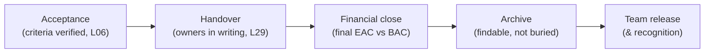

# L30 · Closing Projects & Lessons Learned

## Ending well is a discipline — and a course retrospective in miniature

Week 15 · Unit U6 · CLO6 · 2 hours

<!-- _class: lead -->

---

## Learning objectives

1. **Execute** the closure checklist: acceptance, handover, release, archive
2. **Distinguish** administrative closure from emotional closure for the team
3. **Run** a retrospective that produces *adopted* changes, not wallpaper
4. **Revisit** the L01 exit ticket: what did the course change?

<!-- notes: The L01 callback gives the course its narrative close: the triangle-corner labels students wrote in week 1 return as a measurement of their own learning. CS-41 is the drill. Timing ~5 min. -->

---

## The closure checklist

- **Financial close** is a number: final cost vs baseline, variance explained (L19's machine, final run)
- Premature team release is the classic self-inflicted wound: the hypercare period needs the builders

<!-- notes: The checklist maps to the package's closure domain. The hypercare point lands with anyone who has been yanked off a launch. 4 min. -->

---

## Lessons learned: from wallpaper to adopted change

- The failing pattern: "lessons" listed → filed → repeated verbatim next project
- The working pattern: each lesson names (1) the *trigger*, (2) the *cost*, (3) the **process change**, (4) its **owner**
- Retrospective formats differ; the adoption test does not: *what will be different, who owns it, when is it checked?*

<!-- notes: CS-41 is this exact drill run on the course itself — students experience the working pattern before they forget it. 4 min. -->

---

## CS / DS in the room

- **CS:** a shipped integration whose archive saved the *next* team three weeks — findable beats thorough
- **DS:** the model card (L23) + drift monitors (L20) + retraining owner (L29) as the closure artifact set for ML work
- Your FYP's lessons-learned section is due *with* the project, not after — write it while the pain is specific

<!-- notes: The 'while the pain is specific' line is the retention argument for student projects. 3 min. -->

---

## Case anchor:

**CS-41** — *Course retrospective as a closure drill*: run the full closure checklist on PM-401 itself — acceptance (CLOs), handover (your capstone skills), lessons with owners

<!-- notes: Meta and deliberate: the course closes itself by its own method. The lessons output feeds next cohort's tailoring decisions. Key: instructor/answer-keys/cases/CS-41.md. -->

---

## Discussion

1. What is the emotional job of closure for a team — and what happens to the *next* project when it's skipped?
2. Which lesson from this course will you adopt first in your FYP — and who is your check owner?
3. Should lessons-learned be shared across organizations? What's the cost of *not* sharing?

<!-- notes: Q3's expected direction: industry postmortem culture (aviation vs software) — healthy friction with confidentiality. 6 min. -->

---

## Summary & exit ticket

- Closure = acceptance + handover + financial close + archive + team release
- Lessons learned count only when they carry an owner and a check date
- Emotional closure is part of the deliverable

**Exit ticket (2 min):** reopen your L01 exit ticket — relabel your project's triangle corners. What changed in your labels, and what changed in *you*?

<!-- notes: The L01→L30 ticket pair is the course's narrative arc; collect and skim for the L32 synthesis lecture. Preview L31: AI-assisted PM. -->

---

## References & next lecture

- PMI (2021) *PMBOK® Guide* 7th ed. — project closure practices
- Derby & Larsen (2006) *Agile Retrospectives* — Pragmatic Bookshelf (syllabus-consistent)
- Teaching package: `instructor/teaching-packages/U7-synthesis-capstone/L30-30-closure-lessons.md`
- **Next:** L31 — AI-Assisted Project Management

<!-- notes: Derby & Larsen verified against the L30 package's reading list. Preview L31 with the AI-drafted risk register critique (CS-42). -->
