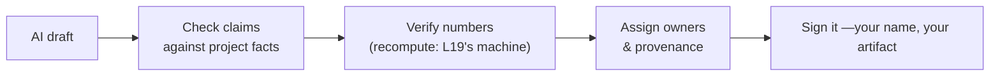

# L31 · AI-Assisted Project Management

## Using the tools professionally — with verification as the default

Week 16 · Unit U7 · CLO6 · 2 hours

<!-- _class: lead -->

---

## Learning objectives

1. **Map** where AI assistance genuinely helps PM work — and where it manufactures confidence
2. **Apply** a verification discipline to AI-drafted artifacts
3. **Draft** a personal/team AI-use policy consistent with course integrity rules
4. **Critique** an AI-drafted risk register like a professional reviewer

<!-- notes: The course's own integrity policy (docs/syllabus, AI rules) is the reference point — students have lived under it all term; this lecture turns it into professional practice. Timing ~5 min. -->

---

## Where AI helps, where it doesn't

| Task | AI assistance | Why |
|---|---|---|
| First-draft risk lists | **strong** | breadth; misses become review items |
| Estimate generation | **dangerous** | confident numbers, no provenance (L10!) |
| Stakeholder drafting | **strong with review** | names and roles need verification |
| EVM computation | **verify every digit** | arithmetic needs provenance and checking (L19) |
| Meeting summaries | **strong** | low stakes, high save |
| Ethical decisions | **no** | accountability cannot be delegated (L28) |

- The pattern: AI is a **drafting engine with no memory of your project** — provenance is the professional's job

<!-- notes: The table is the package's use-map. The estimate row is the trap: confident numbers with no O/M/P provenance are a number wearing a costume (L10 callback). 5 min. -->

---

## The verification discipline

- If you cannot verify it, you cannot ship it — the artifact's signature is **yours**
- AI-drafted ≠ AI-owned: registers, plans, and decisions have human owners (L04's accountability)

<!-- notes: The sign-it step is the professional line this course draws — consistent with the syllabus AI policy's attribution requirement. 4 min. -->

---

## Critiquing an AI-drafted risk register (CS-42's method)

1. **Specificity:** statements without cause–event–effect structure (L15) are only skeletons
2. **Coverage:** what would a *human* hunt have found that the draft didn't? (silent stakeholders, data access)
3. **Arithmetic:** recompute every P×I and EMV — drafts hallucinate products
4. **Ownership:** names that don't match your org are a *gift* — they reveal the draft's fiction
5. **Threshold integrity:** bands that don't match your declared policy (CS-21's lesson)

<!-- notes: The five-check critique is the package's review instrument and CS-42's rubric. It turns the whole term's tools into a review checklist. 5 min. -->

---

## CS / DS in the room

- **CS:** AI-scaffolded status reports — strong save, zero risk if the metrics beneath them are verified (L20)
- **DS:** AI-generated EDA notebooks — the verification discipline is *literally* reproducibility: seed, provenance, check
- The DS irony: the people best trained to validate models are the best trained to validate AI drafts

<!-- notes: The reproducibility parallel is the DS cohort's bridge — same skill, new target. 3 min. -->

---

## Case anchor:

**CS-42** — *AI-drafted risk register critique*: apply the five checks to a provided draft; count what a professional reviewer catches

<!-- notes: The draft is in the case; the key's answer list shows what full verification catches (invented owners, arithmetic slips, missing data-access risks). Key: instructor/answer-keys/cases/CS-42.md. -->

---

## Discussion

1. Where is the *honest* line between 'AI-assisted' and 'AI-written' for a capstone artifact?
2. Your team's AI tool cites a policy your organization never wrote. What does that do to trust — and to your verification duty?
3. Should PM tools disclose AI participation to sponsors? Draft the disclosure sentence.

<!-- notes: Q1 rehearses the course policy's own boundary; Q3's sentence is the professional norm moving toward disclosure. 6 min. -->

---

## Summary & exit ticket

- AI drafts breadth; professionals supply provenance, verification, and ownership
- Verify every digit that enters a baseline or a decision
- The signature on the artifact is yours — that is the whole policy

**Exit ticket (2 min):** write your capstone team's one-sentence AI-use rule — where it helps, where it's banned, who verifies.

<!-- notes: Tickets feed M4's AI-use statement (required in the capstone spec). Preview L32: the defense. -->

---

## References & next lecture

- PMI (2021) *PMBOK® Guide* 7th ed. — stewardship principle (responsible use of resources)
- Course AI policy: [`docs/syllabus/policies.md`](../../docs/syllabus/index.md)
- Teaching package: `instructor/teaching-packages/U7-synthesis-capstone/L31-31-ai-assisted-pm.md`
- **Next:** L32 — Capstone Defense & Course Synthesis

<!-- notes: The AI policy reference is the syllabus's own integrity section — students have operated under it all term. Preview L32 with the defense format and rubric. -->
