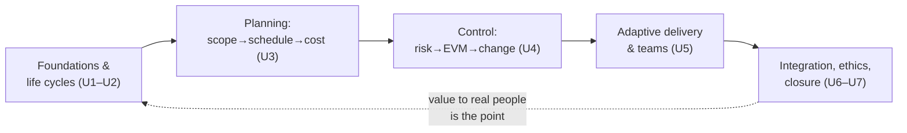

# L32 · Capstone Defense & Course Synthesis

## Defend the plan. Then keep the discipline.

Week 16 · Unit U7 · CLO6 · 2 hours

<!-- _class: lead -->

---

## Learning objectives

1. **Present** an integrated project plan to a panel under time pressure
2. **Answer** probing questions on any artifact's chain (estimates → schedule → budget → risk)
3. **Evaluate** peer defenses with the published rubric, fairly and specifically
4. **Synthesize** the course: which discipline will you keep, and why

<!-- notes: Defense day. Rubric: docs/capstone/presentation-rubric.md (matches instructor/rubrics/capstone-plan.md exactly). Panel = instructor + peers (feedback-only scoring per the peer-review form). Timing: run the defense schedule from the spec, not from this deck. -->

---

## Defense format

| Segment | Time | What's scored |
|---|---|---|
| Plan walk-through | 8 min | integration & clarity (L27's map, live) |
| Panel probing | 6 min | artifact chains — trace any number |
| Scenario question | 3 min | "your R2 fires in week 6 — what happens?" |
| Red-team debrief | 3 min | consistency defense (peer review M3) |

- Every claim must trace to an artifact — the panel reads the *plan*, not the slides
- "I don't know, but here's how I'd find out by Friday" is a **passing** answer; invention is not

<!-- notes: The scenario question rehearses L19/L20 under pressure. The honest-ignorance rule is stated in the rubric — say it aloud; it lowers theater and raises truth. 5 min. -->

---

## The probe questions the panel will ask

- Trace one number: **from WBS package to budget line** (checks #1–2, L27)
- Where is your **contingency** spent from — and on which risks? (L13→L17 chain)
- Which **quality rule** would catch your worst data failure? (L14)
- Your **gate evidence** at M3: who checked it, against what? (L23)
- What did you **cut** in tailoring — and what risk did you accept? (L08)

<!-- notes: These five map 1:1 to the red-team checks and the rubric's evidence rows — no surprises, by design. 4 min. -->

---

## CS & DS examples in this course

- **CS:** the campus-portal arc — charter (L06) → WBS (L09) → network (L11) → EVM (L19) → defense (today)
- **DS:** the churn-model arc — scope with evaluation harness (L09) → data-quality rules (L14) → model DoD & gates (L23) → benefits & footprint (L29)
- Both arcs end here: one integrated plan, defended

<!-- notes: The two arcs are the course's narrative threads — name them one last time so students see their own path. 2 min. -->

---

## Case anchor:

**CS-43** — *Capstone defense simulation*: the dress rehearsal — full format, peer panel, rubric scoring, feedback before the real defense

<!-- notes: If the real defense follows this session, CS-43 IS the rehearsal slot; otherwise it runs as the mock. Key: instructor/answer-keys/cases/CS-43.md (panel brief + scoring sheet). -->

---

## Course synthesis: the map you leave with

- The capstone was the course in miniature: **initiate → plan → control → close**, with governance throughout
- The disciplines that survive: provenance, ranges over points, named owners, documented decisions

<!-- notes: The four-discipline summary is the honest core — these are the transferable habits the exams and the rubric both reward. 4 min. -->

---

## Discussion (final — and it counts as your last exit ticket)

1. Which single course discipline changed how you plan your own work? Show, don't tell.
2. Where will PMBOK-style discipline and Agile instinct conflict in your first job — and what will you do?
3. What should the *next* cohort's version of this course keep, cut, and add? (This is CS-41's lessons-learned, closing the loop.)

<!-- notes: Q3's output is genuinely used — next cohort's tailoring. Close the loop visibly: the L30 drill produced owners; the course is one of them. 8 min. -->

---

## Summary & the last exit ticket

- Defense = traceable claims + honest unknowns + integrated plan
- The course in four habits: **provenance · ranges · owners · documented decisions**
- Projects end; the discipline is portable — that was the design

**Exit ticket (final):** one paragraph — the project you'll run differently now, and the first artifact you'll build for it.

<!-- notes: These paragraphs are the course's real outcome measure — skim for the report to the department. Thank the cohort. -->

---

## References

- PMI (2021) *PMBOK® Guide* 7th ed. — the course's structural spine
- ISO 21502:2020 & ISO 31000:2018 — governance and risk frames
- Schwaber & Sutherland (2020) *The Scrum Guide* · Anderson (2010) *Kanban*
- PMI *Code of Ethics and Professional Conduct*
- Every lab brief, case, and template: [`docs/`](../../index.md) — the course site remains available after the semester

<!-- notes: End with the availability note: the site outlives the semester — students defending FYPs next term will need these templates again. -->
